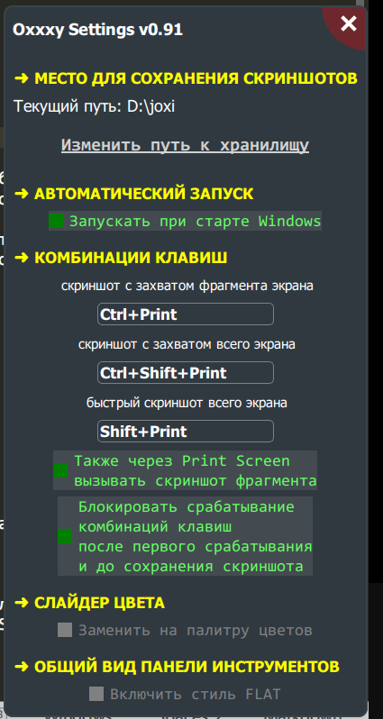
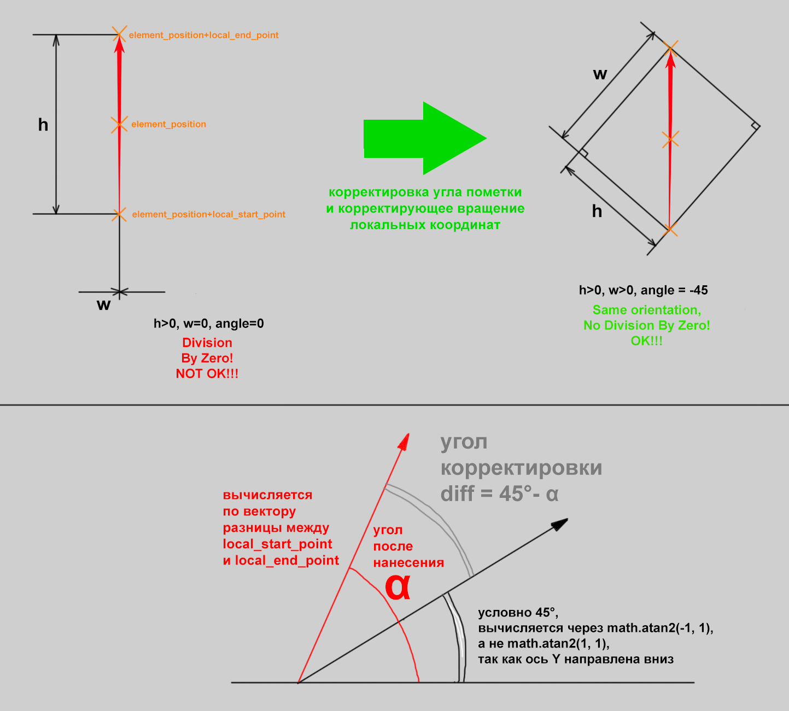

## Интересные факты

- разработка велась исподволь с июня 2021 года по май 2022 года, бетатестирование с мая 2022 по середину декабря 2022
- под конец работы над этим проектом при исследовании файлов скриншотера Joxi внезапно обнаружилось, что он тоже написан с использованием Qt, только уже на C++
- *производительность или зачем писать Qt-приложения на Python*: если б я писал это всё на C++, то, чувствую, что провозился ещё дольше. На Python пробовать, разрабатывать и отлаживать проще, удобней и быстрей. Ну и, если представить меня, автора кода и автора идеи, в виде пары пользователь+программист, то практичный пользователь однозначно взял верх и ему глубоко насрать как оно там внутри, главное ведь работает же! Ну и пока Oxxxy это не то приложение, в котором производительность играет серьёзную роль.
- отличия от оригинала:
   - клон не умеет делать скриншоты с прокруткой
   - созданный скриншот не отравляется никуда, тем более не предусмотрена даже интеграция с каким-либо из облачных сервисов для хранения изображений и файлов
   - нижняя панель под панелью инструментов не скрывается под неё
   - кнопка «Готово» чуть меньшей высоты, чем сама панель инструментов

## Что планируется сделать дальше?
  - **Основное**
      - реализовать намного более точное выделение объектов для инструмента «Выделение и трансформации», а не по boundingBox объекта как сейчас
      - пересматривать и перерабатывать UX и UI в свете того, что Oxxxy отныне является редактором коллажей, а не просто скриншотилкой
  - **Дополнительные тулзы**
      - добавить поддержку хорд для инструмента «Овал»
      - рассмотреть необходимость добавления направляющих типа линейки и транспортира как в скриншотере Windows 10
      - добавить инструмент «для нанесения изогнутых стрелок, срастающихся в основании». Такие стрелки можно наблюдать на картах военных действий и в инфографике
      - добавить возможность записывать видео со звуком или гифки в захваченной области (через расширение на Си)
  - **Подготовка к релизу**
      - перейти с PyQt5 на PyQt6
      - добавить ещё три языка кроме Русского для UI: Немецкий, Французский и Английский
      - капитально отрефакторить код
      - добавить возможность менять размеры шрифтов в UI
      - записать видео на Youtube для пользователей
      - тестирование и обеспечение работы в виртуальном окружении
      - протестировать работу приложения в Ubuntu
  - **Отдалённое**
      - содать версию приложения в виде единого бинарника для Windows

## Changelog, История нововведений
### Версия 0.90 (24 декабря 2022) Первая релизная версия

### Версия 0.91 (26 декабря 2022)
  - Инструмент «Размытие» получил опциональную галочку «Пикселизация»
  - Инструмент «Линия» теперь может рисовать ломанные линии при удерживании клавиши `Ctrl`. Каждый сегмент линии создаётся как отдельная пометка

### Версия 0.92 (12 мая 2023)
  - Ликвидирвоана зависимость от забагованного питоновского модуля `pynput`. Теперь есть надежда, что на линуксах будут работать сочетания клавиш
  - У программы появилось отдельное окно с настройками, в котором можно:
      - заменить слайдер цвета на палитру предопределённых цветов
      - задать общий стиль панели инструментов — с градиентами или без них, т.е. flat
      - задавать путь к хранилищу, в которое будут сохраняться скриншоты
      - включить или выключить автозагрузку приложения в трей при старте Windows
      - менять сочетания клавиш для разных вариантов работы над скриншотом
      - по желанию блокировать дальнейшие нажатия комбинаций клавиш после запуска редактора скриншотера. Это позволит запускать один скриншотер поверх другого
      - разрешить нажатию по единственной клавише `Print Screen` вызывать редактор скриншотера, в таком случае комбинация `Ctrl+Print` или изменённая пользовательская тоже будут работать

      
  - Теперь пометки инструментов «Линия», «Маркер» и «Карандаш» автоматически удаляются, если курсор мышки не двигался за всё время нанесения пометки. Проблема была в том, что если имело место такая ситуация, то такая пометка толком не отрисовываются, однако всё же остаеётся в истории действий. Нахождение таких пометок в истории могло бы вызвать конфуз при использовании `Ctrl+Z`, потому что отмена идёт, а на экране ничего не меняется, поэтому и было внесен данное исправление.
  - Внедрён инструмент «Мультикадрирование». Активируется он уже через контексное меню в пункте «Активировать инструмент мультикадрирования». Затем мышкой предлагается задать произвольное количество прямоугольных областей, которые после нажатии на кнопку «Готово» соберутся вертикально друг за другом в единую картинку. Иногда это может пригодиться как инструмент для создания коллажа, а иногда для того, чтобы сделать серию изображений, на которой масштаб постепенно приближается к зоне интереса скрин.
  - Внедрён расширинный режим редактора для создания коллажей из готовых картинок и пометок поверх них
    - теперь можно перемещаться по холсту с зажатым `Alt` и левой кнопкой мыши, масштабирование отсутствует — об этом ниже
    - отныне можно задавать область захвата, которая будет выходить за пределы фона
    - через клавишу `P` можно смотреть на финальный результат в специальном просмоторщике, где можно приближаться к картинке и перемещать по ней в разные стороны. Это компенсирует то, что в самом редакторе невозможно приближаться и отдаляться. Контекстное меню содержит все требуемые команды для работы с просмоторщиком
    - в этом режиме касательные линии прямоугольника захвата теперь рисуются пунктирными линиями в режиме XOR для большей контрастности с фоном
    - расширенный режим всегда можно выключить или включить через чекбокс в контестном меню
    - полупрозрачная шахматная подложка теперь рисуется под фоном скриншота и за его пределами
  - В дополнение к 3м опциям по вызову скриншотера в меню трея стала доступна ещё 4я под названием «Коллаж». Комбинация клавиш не назначена для неё.
      После клика будет открыт файловый диалог для выбора произвольного количества файлов. В файловом диалоге всегда открывается папка, которая задана в настройках как хранилище для скриншотов
  - Исправлены баги
    - окно с уведомлением о создании скриншота при появлении на экране больше не забирает на себя фокус
  - При использовании Канадской многоязычной раскладки в Windows никак не работали комбинации клавиш с правым `Ctrl`, приходилось зажимать намного более неудобный левый `Ctrl`. В итоге перебрав разные варианты решения проблемы теперь нажатие по клавише `Print Screen` делает то же самое, что и нажатие сочетания клавиш `Ctrl+Print Screen`
  - Добавлены новые команды в контексное меню
      - «Сбросить область захвата» позволяет задать область захвата заново, как это делается в самом начале перед появлением панели инструментов. Клавиша `Esc` возвращает прежнюю область захвата на случай, если вы передумаете её менять.
      - «Подтянуть панель инструментов» позволяет панели инструментов оказаться рядом с курсором мыши, если она уехала за область видимости, что бывает актуально в расширенном режиме.
      - «Задать область захвата» задаёт область захвата на основе позиции и габаритов всех пометок таким образзом, чтобы они все поместились в неё с некоторым запасом в десяток пикселей по бокам.
      - «Автоколлаж» разместит пометки-картинки либо вертикально, либо горизонтально. Желательный порядок картинок задаётся их положением друг относительно друга по горизонтали. Все картинки подгоняются по размеру под самую большую, при этом учитывается предшествующее кадрирование изображения. Область захвата будет автоматически поправлена, учитывая совокупный размер коллажа по двум осям. Хоть картинки и будут обрабатываться каждая по-своему отдельно, система истории будет воспринимать такую операцию с картинками как одно неделимое действие.
      - «Трансформация фона» позволяет повернуть и растянуть картинку по всем осям или только по одной из осей. Всё работает через клики левой кнопкой мыши. Точка поворота выбирается первым кликом перед непосредственным поворотом. Для включения/выключения растягивания по той или ной оси надо нажимать по клавишам `X` или `Y`. Получившуюся трансформацию фона всегда можно сбросить при клике по соответвующему пункту в контестном меню.
      - «Сохранять результат в память» и «Достать скриншоты из памяти». Команды реализуют функционал для частично замены функции «Прокрутка» из оригинального скриншотера Joxy.
        После активации пункта меню «Сохранять результат в память» в программе активируется специальный режим, в котором все скриншоты после нажатия кнопки «Готово» будут сохранятся в память программы, а не на диск с последующим уведомлением. Вдобавок кнопка «Готово» теперь будет иметь красный цвет, чтобы пользователь не забывал об этом.
        После нажатия кнопки готово нужно проскролить до нужного места то, что собираемся скриншотить и снова вызвать редактор скриншота. Когда все части будут захвачены, их можно будет собрать в один скриншот, вызвав редактор и кликнув в контекстном меню по пункту «Достать скриншоты из памяти». В результате дополнительно будет задана область захвата, отключится чекбокс «Фон» и чекбокс «Сохранять результат в память», и кнопка «Готово» вернёт себе обычный цвет и по нажатию на нёё «Готово» программа сохранит на диск готовый скриншот и покажет уведомление.
        Фича пригодится, когда нужно заскриншотить длинный диалог, который открыт не в браузере (в браузерах есть удобные скриншотеры-расширения)
      - «Переснять скриншот». Всё говорит само за себя.
  - Отладка
    - Теперь дебажный список пометок (в коде пометки это `elements`) может отображаться от положения курсора мышки, если области захвата ещё не задана
  - Теперь можно выбрать включать ли фон скриншота в результат или нет (полезно для коллажей, которым этот фон обычно не нужен)
  - Теперь программа может запоминать размеры и положение области захвата между вызовами. Для этого достаточно лишь кликнуть соответствующий чекбокс внизу панели инструментов
  - Теперь эффект инструмента «Затемнение» накладывается поверх всех пометок, если в контекстном меню выставлен чекбокс «Затемнять после отрисовки пометок»
  - Через `Ctrl+V` теперь всегда вставляется картинка, и не важно выбран ли при этом инструмент «Картинка» (ранее назывался «Штамп»)
  - В контекстном меню сменилась иконка для команды полной остановки программы
  - Среди всех пометок пометки-изображения теперь рисуются в первую очередь, чтобы остальные пометки всегда были поверх них
  - Можно обрезать (кадрировать) пометки-изображения в специальном редакторе, вызываемом из контестного меню. Для этого надо сначала выделить нужную пометку-изображение через инструмент «Выделение и трансформации». Сделано это для того, чтобы иметь возможность обрезать изображения, которые не помещаются на экране, но вообще можно обрезать любые. Область для кадрирования задаётся курсором мыши с зажатой левой кнопкой. Из редактора кадрирования можно выйти нажав клавишу `Esc`. В редакторе кадрирования можно бесконечно долго переопределять область обрезки заново. Затем, будучи удовлетворённым результатом, надо нажать на `Enter`. После такой обрезки всегда можно вернутся в редактор кадрирования и изменить такую образку сколько угодно раз. Сбросить обрезку можно через контекстное меню при условии, что пометка-изображение будет выделено инструментом «Выделение и трансформации».

### Версия 0.93 (1 октября 2023)
  - После нажатия кнопки «Готово» теперь принудительно закрываются все открытые окошечки из трея, чтобы программа перезапустилась, и, уже после перезапуска смогла в дальнейшем обрабатывать сочетания клавиш (по дефолту после первого вызова она перестаёт это делать)
  - Исправлен баг с заблюренной лупой
  - Изменена расстановка пунктов в контекстном меню
  - Через `Ctrl+V` теперь можно вставлять .svg- и .svgz-файлы в виде картинок
  - Избавился от костыля - переопределения класса QPoint
  - Исправлен баг: курсор изменялся на дефолтный при зажатой левой кнопке мыши при перетаскивании области захвата
  - Исправлен баг: в режиме редактора перестал работать антиальясинг
  - Исправлен баг: после команды «Автоколлаж» не сбрасывался виджет трансформации и панель инструментов не позиционировалась согласно обновлённой области захвата
  - В контекстное меню добавлена галочка «Закрывать редактор после нажатия кнопки Готово». В окне уведомления о созданном скриншоте теперь отображется имя сохранённого файла
  - Теперь режим задания клавиш-модификаторов активируется когда поле комбинации клавиш получает фокус ввода. После того как клавиши будут отпущены, пропадёт фокус и режим задания выключается. Раньше режим активировался при показе и дезактивировался при скрытии окна настроек. Благодаря этому изменению отыне можно сделать скриншот самого окна настроек.
  - Инструмент «Штамп» переименован в «Картинка». По этому случаю код отрефакторил
  - UX: картинки, добавленные через кнопку «Коллаж» теперь отображаются в обычном масштабе, а не в уменьшенном в два раза как раньше
  - Исправлен баг: теперь не должно быть зазора между картинками после команды «Автоколлаж»
  - Исправлен баг^^: теперь при выборе картинки через инструмент трансформации слайдер размера принимает правильные текущие значения
  - UX: теперь правка параметров размера и цвета пометки через колесо мышки работает только когда при этом курсор мыши находится поверх пометки
  - В контекстное меню добавлена команда «Содержимое в фон». Она рендерит в фоновое изображение все пометки и затем удаляет их так, что их уже не отредатируешь. Действие отменить нельзя. Пригождается когда нужно собрать из картинок-пометок новую картинку через инструменты «Копипейст» и «Лупа»
  - Во вьювере результата (доступен через клавишу P) можно задавать область захвата. После нажатия `Enter` область будет присовена инструменту «Картинка» для вставки
  - В контекстное меню добавлена команда «Подогнать все картинки по размеру под одну». Картинка, под которую подгоняется, предварительно выбирается инструментом «Выделение и трансформации», иначе подгонка будет под первую картинку из набора всех картинок. Картинки сдвигаются либо вниз, либо вбок для удобства выделения. Действие отражается в истории действий.
  - Для слайдеров цвета, размера и прозрачности заданы подсказки при наведении курсора мыши на них
  - Добавлен слайдер прозрачности для картинок
  - Исправление исправления бага, помеченного ^^
  - Рамку в просмоторщике картинок теперь можно задавать и изменять с помощью виджета задания области захвата. Всё осталось работать через зажатый `Ctrl`.
  - Добавлена возможность сохранить и загрузить проект через команды в контекстном меню «Сохранить проект» и «Открыть проект».
    - ЗАОДНО исправил баг: теперь удаление выделенного элемента через клавишу `Delete` обновляет доступность кнопок истории, которые раньше на это не реагировали
  - Всплывающие уведомляющие диалоговые окна (через клавишу `Esc`, после сохранения и загрузки проекта) теперь плавно меняют цвет заливки заднего фона, чтобы быть более заметными на фоне общей цветовой каши.
  - Команда «Содержимое в Фон» теперь учитывает ситуацию, когда содержимое по габаритам может превосходить фоновую картинку, и, поэтому предлагает расширить её, чтобы в результате не было нежелательных обрезок контента
  - Теперь через `Ctrl+V` можно вставлять кадры из анимированные webp- и gif-файлов, предварительно выбрав нужные кадры и их выставив нужную обрезку
    - можно включить/выключить воспроизведение анимации через клавишу `Пробел`
    - клавиши `Влево` и `Вправо` позволят перелистывать кадры
    - через колесо мыши и зажатые `Ctrl+Shift` можно задавать скорость
    - через зажатую левую кнопку мыши и вращение колеса мыши можно перелистывать кадры
    - включить или исключить картинку из кадра можно через клавишу `Enter` (при включении картинка не обрезается)
    - выбрав нужные кадры нужно нажать `Ctrl+Enter`
    - кадры вставятся сразу как картинки либо через инструмент «Картинки» (первая будет выставлена в инструмент, остальные же поместятся в магазин, откуда они будут изыматься по мере клика левой кнопкой мыши)
  - Во встроенном вьювере контестное меню заменено на удобную нижнюю панель с кнопками в виде иконок. Эта панель практически полностью скопирована с такой же панели в Krumassan Image Viewer. В контестном меню осталась лишь команда «Закрыть»
  - Для встроенного вьювера работает справка через кнопку на нижней панели или через клавишу `F1`
  - Во встроенном вьювере кнопки поворота картинки поменяны местами
  - Во встроенном вьювере можно отражать картинку и по вертикали, для этого нужно лишь зажать `Ctrl` перед нажанием клавиши `M`
  - Во встроенном вьювере появилась возможность трансформировать (вращение, масштабирование) картинку и каждый фрейм отдельно у каждого кадра анимированной картинки
      - примечание: для того, чтобы фрейм из анимационного файла экспортнулся в OXXXY, надо задать ему рамку размером с него самого с помощью `Ctrl+Enter`
  - Во встроенном вьювере обновлена отрисовка двух кнопок
  - Виджет трансформации теперь умеет в пропорциональное масштабирование, что как раз пригодится для картинок, и для активации достаточно зажать `Ctrl`. Для квадратных размеров надо зажимать `Ctrl+Shift`
  - Пофиксил баг: после использования инструмента, который делает картинку из пререндера, при последующем запуске клик по любой области выдаёт вылет, но перед вылетом показывается менюха превьюшек.
  - Скороллбар у меню инструмента «Картинка» стилизован под общий визуальный стиль программы

### Версия 0.94 (дата не определена)
  - Отрефакторил `do_scale_image` во встроенном просмоторщике согласно изменениям в донорском приложении Krumassan Image Viewer
  - `pyperclip` больше не нужен и удаляется из зависимостей
  - внедрение PZMT (Canvas Panning & Zooming и Elements Multiselect & Transformations) для холста в редакторе
      - ДЕТАЛИ
          - отрисовка всего за счёт вычислений на основе опорного ориджина и величины скейла холста по двум осям
          - координаты мыши должны мапится из координат вьюпорта в координаты холста, учитывая скейл и положение опорного ориджина
      - прописал основные переменные и функции
      - отрефакторил так, чтобы программа хотя бы запускалась
      - перемещение холста (panning) теперь работает через зажатое колесо мыши
      - зум холста (zomming) работает через колесо, пока колесом нельзя менять параметры инструментов как раньше, метод пока больше `change_tools_params` не вызывается
      - теперь рамка захвата адекватно отрисовывается во время zooming и panning
      - восстановлено перемещение рамки захвата (эта функция доступна, когда не выбрано ни одного инструмента)
      - восстановлено обновление курсора мыши для областей, образуемых касательными линиями проведёнными к прямоугольнику области захвата
      - восстановлено автопозиционирование панели инструментов в зависимости от зума и смещения
      - восстановлено изменение границ рамки захвата через мышь
      - удалён легаси-код виджета трансформации
      - удалён легаси-код трансформации фона (фон будет представлен картинкой, которую можно трансформировать как вздумается)
      - фоновое изображение (скриншот) теперь исполнено в виде пометки-изображения
          - заодно пришлось очень много рефакторить
      - восстановлена корректная отрисовка дебажной превьюхи результата
      - восстановлена корректная отрисовка списка элементов в дебажном режиме
      - восстановлен рендер финальной картинки
      - появилась возможность зумить холст когда область захвата ещё не задана, для этого нужно удерживать `Alt`
      - вроде как теперь восстановил функциональность лупы
      - зум при зажатом `Alt` работал только в одну строну из двух возможных, поэтому пришлось заменить `Alt` на комбинацию `Shift+Ctrl`
      - исправил позиционирование лупы при zooming и panning для случая, когда область захвата ещё не задана. Вдобавок ушли баги, проявляющиеся *во время задания* области захвата
      - автоматическое позиционирование панели инструментов теперь работает и при переносе холста (panning)
      - в контекстное меню добавлена галочка для отключения фона
      - подправил лупу задания области захвата, чтобы эта лупа выдавала нужное значение цвета при задействованном зуме (zooming) и смещении холста (panning)
      - автоматическое позиционирование панели инструментов теперь работает и при зуме холста (zooming)
      - поправил переключение режимов прозрачности фона через клавишу `Tab`. Когда фон можно будет свободно трансформировать и фон будет выходить за рамки экранов, надо будет просмотреть насколько адекватно всё отрисовывается и внести правки по наобходимости
      - изменение управления: зумить холст (zooming) можно теперь ещё и при отображающиейся лупе с помощью одного колеса, а чтобы зумить саму лупу теперь надо зажимать `Ctrl` и крутить колесо
      - рефакторинг: избавился от legacy-переменной `elements_global_offset`
      - рефакторинг: избавился от legacy-переменной `background_transformed`
      - рефакторинг: вынес описание класса Element из метода миксина
      - рефакторинг: избавился от legacy-переменных с префиксом `f_`
      - при рефакторинге забыл задать смещение финальной отрисовки на координаты верхнего левого угла области захвата, из-за чего область захвата съезжала к началу координат в левый верхний угол
      - в режиме дебага (`DEBUG=True`) больше не отображается оверлей результата. Посмотреть на то, что в данный момент получается в чистовом виде можно нажав на клавишу `P` (повторным нажатием клавиши можно закрыть это отображение)
      - фикс краша: клавишу `P` не отображал результат без заданной области захвата
      - написал маппинг координат курсора мыши во время клика на координаты холста во время нанесения пометки
      - --------------------- 2024 ----------------------
      - отрисовка элемента для инструмента «Линия» переписана так, чтобы отражать перемещение, повороты и масштабирование пометки (элемента) при всём этом реагируя на перемещение и масштабирование вьюпорта. До этого поддерживалось лишь перемещение вьюпорта и перемещение пометки
      - через инструмент «Трансформация» реализовано выделение и перетаскивание пометок, пока только для пометок инструмента «Линия». Заодно частично удалён старый код
  - внезапная фича: в панели управления теперь можно поставить галочку «Курсор», и при её активации будет рисоваться курсор на скриншоте
  - внедрение PZMT (Canvas Panning & Zooming и Elements Multiselect & Transformations) для холста в редакторе (продолжение)
      - через инструмент «Трансформация» реализовано вращение пометок (пока только для пометок инструмента «Линия»)
      - через инструмент «Трансформация» реализовано масштабирование пометок (пока только для пометок инструмента «Линия»)
      - добавлен код обработки отпускания кнопки мыши (который я забыл добавить сразу)
      - теперь доступна отмена трансформаций в процессе через клавишу `Esc`
      - проверена адекватная трансформация в процессе зума (zooming) вьюпорта
      - проверена возможность выделять пометки прямоугольником, задаваемым курсором мыши
      - вернул вызов функции `elementsSelectedElementParamsToUI` после работы функции выделения. Теперь, если выделено больше чем одна пометка, то контролы настройки пометки на панели управления прячутся
      - восстановлена работа метода `elementsSetSelected` для выделения единственной пометки или сброса имеющегося выделения, дополнительно вычищен код от демонов прошлого
      - теперь как и раньше сбрасывается выделение, если выбирается другой инструмент
      - вернул возможность циклического выделения перекрывающих друг друга пометок в позиции курсора мыши: фича теперь работает при зажатой клавише `Ctrl`, без неё сделать не получилось, потому что код циклического выделения всегда конфликтовал с кодом начала перетаскивания, который учитывает случай, что перетаскивание может начаться над невыделенной пометкой
      - пока отключено выделение картинки, которая составляют сам скриншот. Позже её можно будет включить через контекстное меню. Плюс вычистил код от багов, которые быши внесены попыткой сделать циклическое выделение без использования зажатой клавиши `Ctrl`
      - перенесены курсоры для масштабирования и вращения виджета трансформации
      - дебажная отрисовка виджета трансформации отключена за ненадобностью, ведь курсор мыши теперь подскажет где и какая трансформация активируется. При желании дебажную отрисовку можно включить в контестном меню
      - проверил работу клавиш-модификаторов в поворотах и масштабированиях
      - переделал активацию циклического выделения
      - восстановлена работа галочки «Обтравка»
      - восстановлена работа галочки «Трети»
      - восстановлена работа галочки «Запомнить захват»
      - восстановлена работа инструментов «Карандаш» и «Маркер», оба поддерживают новое выделение, собственные трансформации и panning & zooming
      - восстановлена работа инструмента «Стрелка» с поддержкой нового выделения, собственных трансформаций и panning & zooming
          - виджет перестаёт работать, если стрелка вытянута строго по вертикали или горизонтали (ошибка деления на ноль)
      - пропускаю восстановление инструмента «Текст», там нужно будет заменить виджет и переписать нанесение, отрисовку, выделение и трансформацию
      - восстановлена работа инструмента «Овал» с поддержкой нового выделения, собственных трансформаций и изменения вьюпорта
      - восстановлена работа инструмента «Прямоугольник» с поддержкой нового выделения, собственных трансформаций и panning & zooming
      - восстановлена работа инструмента «Нумерация» с поддержкой нового выделения, собственных трансформаций и panning & zooming
      - восстановлена работа инструмента «Размытие» с поддержкой нового выделения, собственных трансформаций и panning & zooming
      - восстановлена работа инструмента «Затемнение» с поддержкой нового выделения, собственных трансформаций и panning & zooming
          - благодаря трансформациям пометки теперь можно задавать области затемнения с поворотом
      - восстановлена работа инструмента «Затемнение» с поддержкой нового выделения, собственных трансформаций и panning & zooming
          - инструмент активируется через контекстное меню
      - продумал детали новой реализации истории пометок
          - теперь история будет реализована через массив объектов `ElementsHistorySlot`, каждый из которых будет иметь массив пометок `Element` размером от одного (для обычных пометок), до двух (для пометок инструментов «Лупа» и «Копипейст»), и до нескольких (для версий пометок, созданных с помощью инструмента «Трансформация», ведь выделять можно несколько объектов, соответственно эти несколько объектов будут изменены единовременно и в истории изменений должны идти вместе)
          - удобная сериализация всего этого дела для сохранения на диск и чтения проектного файла
      - рефакторинг системы истории действий под новые требования
          - прописал класс слота
          - прописал создание слотов
          - прописал отрисовку дебажной инфы
          - избавляюсь от `history_group_id` в истории действий
          - слоты могут быть использованы для вставки серии пометок за один раз в плане истории действий
          - кнопки истории дейстий теперь влияют только на слоты
          - доработал вывод дебажной инфы
          - переписал удаление элементов учитывая то, что теперь можно выделять несколько пометок
          - введение индексового атрибута для `historySlot` (нужно для сохранения в файл)
          - не даём копировать атрибуты связанные с `historySlot` при копировании
          - поправил работу копирования более одной пометки, когда они выделены и нажимаются стрелки на клавиатуре
               - есть небольшая проблема с тем, что в результате каждая выделенная пометка сидит в отдельном слоте, это надо будет исправить потом
      - восстановлена работа инструмента «Картинка» с поддержкой нового выделения, собственных трансформаций и panning & zooming
          - восстановлена работа инструмента из панели
          - слайдера задания размера больше нет у картинок - изменение размера производится теперь за счёт виджета трансформации
      - восстановлена работа режима «Коллаж», активирующегося через кнопку в окне у системного трея
      - восстановлена работа режима отладки пометок с заданной рамкой захвата (избавился от вызова удалённого метода `elementsSetPictureElementPoints`)
      - избавился от вызова `elementsSetPictureElementPoints` в методе обрезки картинки
      - избавился от вызова `elementsSetPictureElementPoints` в методе обрезки серии картинок
      - избавился от вызова `elementsSetPictureElementPoints` в методе вставки картинки из буфера обмена
      - избавился от вызова `elementsSetPictureElementPoints` в методе подгонки серии картинок под одну
      - избавился от вызова `elementsSetPictureElementPoints` в методе автоколлажа
      - избавился от вызова `elementsPictureRect`, определение которой ранее удалил
      - вернул поровоты инструменту «Картинка». Поворот можно изменять зажав правую кнопку и крутя колесо мыши
      - доработал дебаг-список пометок. Теперь он отображает значения `element.size` и `element.color`
      - восстановление работы инструменов «Лупа» и «Копипейст»
          - для начала сделал так, чтобы не крашилось при нанесении и отрисовке, баги не исправляются, ибо их присутствие на данном этапе приемлемо
          - прописано нанесение и базовая отрисовка для нужд отладки, пока в процессе
          - нашёл блокировку смены инструмента, если позиция второго компонента не введена пользователем
          - частично переписал отрисовку под новую организацию
          - написал функцию, которая копирует из QPixmap прямоугольную область под заданным углом
      - картинка в инструменте «Размытие» теперь поддерживает вращения и масштабирования
      - восстановление работы инструменов «Лупа» и «Копипейст»
          - восстановлена работа инструмента «Копипейст»
      - инструмент «Лупа»: отрисовка линий выпуклой оболочки без транформации, учитывая поворот обоих элементов
          - точки первого элемента (пометки) надо получить относительно канваса (`canvas`) и уже повёрнутые и отскейленые
      - полностью восстановлена работа инструмента «Лупа»
          - отлажено, проблема была во входных данных, а не в самом алгоритме. Во многом проблема была в QPolygonF, который выдаёт 5 точек вместо 4, и ещё дополнительно глючит. В сам алгоритм встроен предохранитель от бесконечного зацикливания.
          - восстановлена отрисовка выпуклой оболочки для случая, когда введён первый компонент, а второй компонент ещё не введён
      - пофиксил глитч в инструменте «Копипейст», когда превьюшка результата увеличивалась в размерах
      - отрефакторил метод `elementsGetElementsUnderMouse`, он пригодится далее, чтобы с помощью колеса мыши управлять параметрами метки
      - `self.selected_element` заменён на `self.active_element` и теперь он нужен для получения последнего выделенного на данный момент элемента
      - проверена работа команды из контекстного меню «Обрезать выделенное изображение»
      - баг: рамка выделения не обновляется при во время смещения холста
      - восстановлена вставка статических картинок через `Ctrl+V`
      - проверена вставка анимированных картинок через `Ctrl+V` - работает без нареканий
      - восстановлена команда контекстного меню «Переснять скриншот»
          - новые версии фона перекрывают предыдущие. Всегда можно вернутся к прежней версии фона, если удалить текущую версию фона
      - исправление краша: после удаления пометки через клавишу `Delete` нужно снимать выделение с удалённой картинки. Вдобавок надо было прописать реакцию на пометки типа `ToolID.removing` для кода выделения и создания виджета трансформаций
      - команда «Содержимое в фон» переименован в «Нарисовать содержимое на фоне и удалить содержимое»
      - команда «Нарисовать содержимое на фоне и удалить содержимое» восстановлен в рамках PZMT
          - теперь содержимое не удаляется, вместо этого история отматывается так, чтобы видно было только фон
          - если идёт обрезка по рамке захвата, то рамка захвата переносится
          - добавлена третья опция
          - добавлена поддержка инструмента мультикадрирования в команде
      - инструмент «Мультикадрирование» теперь поддерживает фрагменты с вращением
      - команда «Автоколлаж» налажена и теперь поддерживает трансформированные картинки
          - «Автоколлаж» подгоняет все картинки на максимальную высоту или ширину в зависимости от горизонатального или вертикального расположения в ряд
          - «Подогнать все картинки по размеру под одну» подгоняет остальные картинки под активную картинку (активная картинка это выделенная кликом картинка). Если активной картинки не будет, то результат будет схожим с командой «Автоколлаж»
      - в правом нижнем углу рамки захвата теперь отображается действительное разрешение рамки захвата, а не её проецируемое разрешение на экран в данный момент
      - рефакторинг команды «Автоколлаж»
      - команда «Подогнать все картинки по размеру под одну» налажена и теперь поддерживает трансформированные картинки
      - команда «Задать область захвата» отрефакторена и поддерживает новые стандарты
      - команда «Сбросить область захвата» проверена на работу в новых стандартах. К обнулению ещё добавлен и ресет активного инструмента
      - баг: курсор-образ у инструмента «Картинка» должен отображаться только в области захвата, которую я забыл отобразить на вьюпорт
      - проверена работа галочки «Сохранить скриншот в память» в контекстном меню. Всё работает штатно. Когда программа вытаскивает скриншоты из памяти, то используется уже отлаженный и проверенный метод `request_editor_mode`
      - пофиксил инструмент «Текст» так, чтобы его использование хотя бы не крашило программу
      - вернул инструменту «Размытие» затемнение для исходника. Эффект затемнения лучше виден, когда снята галочка «Затемнять после отрисовки пометок» в контекстном меню
      - UX: теперь можно менять доступность пометок к выделению
        - правым кликом по иконке инструмента «Выделение и трансформация» можно решить, какие пометки будут доступны к выделению: либо только те, что формируют фон (скриншот), либо только те, что формируют контент (непосредственно сами пометки), либо вообще абсолютно всё
        - затронутые методы: `elementsFilterElementsForSelection`, `elementsPicturesFilter`, `elementsSetCaptureFromContent`
        - пользоваться скриншотером стало чуть удобнее
        - добавлена строка о меню во всплывающей подсказке инструмента
      - баг: при повторном редактировании границ обрезки изображения эти самые границы только отображались, но не получилось их исправить, так как манипуляции с зажатым `Ctrl` и мышкой лишь задавали новые границы. Отныне это исправлено
      - подправил стили пунктов-флажков во всех меню
      - UX: Виджет области захвата теперь можно выключить при необходимости кликнув по одноимённому пункту в контекстном меню. При отключении виджета отключается возможность поправить рамку захвата, курсор мыши устанавливается так, будто весь экран это область захвата, дополинтельно отключается затемнение не незахваченых областей
      - UX: `Ctrl+A` теперь позволяет либо снять выделение, либо выделить всё, что доступно по фильтру доступности к выделению
      - UX: вокруг каждой выделенной пометки теперь рисуется пунктирная обводка, чтобы можно было понять выделена ли пометка, которая геометрически находится внутри другой выделенной пометки
      - UX: в контекстно меню добавлена команда «Сбросить смещение и зум»
          - добавлена ещё одна команда «Сбросить только смещение»
          - добавлена ещё одна команда «Сбросить только зум»
      - UX: добавил подменю «Доступные к выделению» в контекстное меню
      - UX: теперь клавиша `F` позволит спозиционировать редактор вокруг выделенной пометки или группы выделенных пометок
          - сочетание `Ctrl+F` позволяет спозиционировать редактор на области захвата
          - введено исправление. Теперь при исполнении команды программа будет считать рабочей областью только первый монитор, а не все мониторы
      - UX: добавлен курсор переноса для виджета трансформаций пометок, он отображается только над выделенными пометками
      - баг: курсоры виджета трансформации отображаются до активации процесса, но не отображаются в процессе
      - опция «Сохранить скриншот в память» переименована в «Сохранить результат в память», команда «Достать все скриншоты из памяти» переименована в «Разложить на холсте все готовые изображения из памяти». Сделано из соображений того, что OXXXY теперь не просто редактор скриншотов, это ещё и простой редактор изображений
      - баг: после появления панели инструментов кнопки истории действий не отображались в актуальном состоянии. Клик левой кнопкой мыши в пустоту с актвированным инструментом «Выделение и Трансформация» менял состояние кнопок, и мне думалось, что там создаётся лишний слот действий. Но оказалось, что, создав слот с фоном, я забыл вызывать метод возведения в актуальное состояние. После вызова этого метода проблема ушла.
      - активация инструмента «Выделение и Трансформация» обычно выделяла последнюю добавленную на данный момент пометку. Сейчас эта пометка - картинка, которая составляет фон, то есть непосредственно скриншот. На старте можно выделять только нефоновые пометки, поэтому я поправил выделение при акцитивации инструмента так, чтобы учитывался фильтр выделения
      - история действий: решено пока не записывать историю действий для пометок инструмента «Лупа» и «Копипейст». Их надо копировать целой коллекцией, даже если копируется одна из двух пометок и всегда надо создавать для них отдельный слот в истории действий
  - внезапная фича: для лупы задания рамки захвата теперь слева снизу от курсора мыши списком отображаются копируемые цвета
  - внезапная фича: у всплывающего окна у трея теперь есть контекстнео меню, благодаря которому можно быстро перезапустить приложение
  - UX: теперь трейсбек после краша приложения пытается отобразиться сразу
  - UX: теперь маску можно видеть в превью финального результата, который отображается через клавишу `P`
  - UX: чекбоксы в контекстном меню редактора теперь выполнены в виде виджетов и клик по ним позволяет больше не прячет контекстное меню
  - UX: отмена перезапуска в дебаг-режиме. Перезапуск не даёт выводить сообщения от print сразу, выводя их только после завершения приложения
  - внедрение PZMT (Canvas Panning & Zooming и Elements Multiselect & Transformations) для холста в редакторе (продолжение)
      - проверил работу истории действий в командах контекстного меню «Автоколлаж» и «Подогнать все картинки по размеру под одну»
      - проанализировал и вспомнил деталия обнуления истории действий в режиме «Сохранить результат в память». Каждый раз запускается новый объект класса редактора, поэтому история не переходит между сессиями этого режима
      - войти в режим дебага теперь можно из недебажного режима. Это очень пригождается, когда хочется посмотреть содержимое слотов истории действий
      - нарисовал дебажную отрисовку всех пометок `Element` слева от области захвата в режиме дебага
      - исправлена отрисовка инструмента «Лупа». Рамка захвата теперь не рисуется поверх увеличенной версии
      - добавлена автоматическое анимированное насение пометок, активируется при нажатии на клавишу `F2`. Перед нажатием на клавишу `F2` требуется определить область захвата
      - настало время доделывать последний инструмент «Текст». Наконец я могу его сделать самостоятельно, без использования виджета, который принимал бы оконные сообщения. Изначально планировалось разместить его в отрицательном квадранте экранных координат, а на холсте рисовать его собственный скриншот со смещением, вращением и масштабом текстовой пометки. Скриншот редактора текста обновлялся бы, если этот виджет мог захватывать фокус ввода, и тогда бы на него шли события клавиатуры, а события мыши можно было бы транслировать за счёт обратной трансформации. Но я решил отказаться от этого в пользу не очень функционально обогащённого, но зато своего компонента, с которым будет меньше подобной возни, и учитывая, что текстовая пометка должна скейлится и вращаться
      - в файле `_text_field_prototype.pyw` создан набросок для собственного компонента работы с текстом
          - отрисовка текста с заданием ограничивающей ширины
          - отрисовка курсора
          - определение позиции курсора по координатам x и y
          - задание длины и позиции каждой строки отдельно, что может помочь варьировать длину каждой строки для случая, когда абзац повёрнут и тогда у каждой строки будет разная длина, если учитывать ограничивающую рамку захвата, за которую текст не должен вылезать
      - клавиша `F3` реализовывает один из способов сброса искажений пометки после скейла
      - решена проблема с искажением пометок после масштабирования, особенно после неоднородного масштабирования. Долго думал над этой проблемой, в итоге всё решила смекалочка.
          - ранее планировалось:
              - воспользоваться методом `QPen.setCosmetic` и вычислять каждый раз размер кисти
              - переделать метод получения объекта трансформаций `Element.get_transform_obj`, убрав локальный скейл (но не вышло, ибо с шириной и высотой объекта он не работает, да и не должен работать)
              - сделать дубликат пометки и записывать в неё информацию, которая не будет вызывать искажений. И втоге одолел этот вариант, но я не стал его реализовывать в таком виде, а просто перед отрисовкой каждого элемента сохраняю исходные значения переменных, потом модифицирую их как требуется, рисую пометку, и затем возвращаю исходные значения переменных. И всё работает!
      - исправлен баг: при скейле относительно противоположного угла как раз именно этот самый противоположный угол съезжал по координатам. Особенно это было заметно, если был задан поворот. Противоположный угол являлся пивотом и его координаты были сохранены и не должны были менятся, однако, выяснилось, что они перезаписываются в методе определения угла поворота для курсора.
      - теперь можно вращать пометки относительно угла, для этого надо зажать `Alt`. Это более подходящий способ вращения для пометок от инструментов «Стрелка», «Линия» и т.д.
      - исправлен баг: запись рамки захвата происходит теперь во время активации галочки «Запомнить захват», раньше так не было, и при повторном запуске отображалась давно сохранённая рамка, потому что её сохранение тригерилось только на первичное задание и перезадание при включённой галочке
      - восстановление истории действий
        - избавился от костыля Element.fresh
        - в дебаг-режиме теперь отображется активная пометка
        - в дебаг-режиме теперь зачёркиваются невидимые слоты (как это было сделано для пометок в слотах)
        - избавление от костылей прошлого, перенос кода на работу с переменной `self.active_element` и попытался разобраться в том, что вообще сейчас происходит
        - пофиксил баг, из-за которого не усваивалось изменение размера компонентом
        - введён `modification_stamp`, который будет нужен для того, чтобы во время любого редактирования пометки не создавались копии при каждом движении слайдера или при удержании клавиш-стрелок для перемещения
            - реализовано для перемещения выделенной пометки через клавиши-стрелки
            - реализовано для трансформаций пометок при помощи мыши
            - реализовано для изменения слайдеров параметов пометки на панели управления (цвет, размер и прозрачность)
            - реализовано для изменения галочки пометки («подложка», «размытие», «линии» и пр.)
            - реализовано для метода `elementsArrangePictures` («Автоколлаж» и прочие команды размещения изображений)
        - ликвидирование лавинообразного дублирования пометок при выделении прямоугольником
        - теперь устанавливается один слот для изменения группы выделенных пометок, а не отдельный для каждой
        - в переменную типа контента слота записывается место из которого была порождена модификация
        - пофиксил всратый стрёмный баг с групповым вращением, который был вызван добавлением кода в прошлых коммитах
      - пофиксил краш при использовании инструментов «Карандаш» и «Маркер»
      - восстановление истории действий (продолжение)
        - пояснения: ранее планировалось копировать целый слот при модификации одной из двух подпометок инструментов «Лупа» и «Копипейст». Однако, пришлось отказаться от этого решения, потому что логика слотов в том, чтобы группировать одно действие или команду. А по отклонённому решению для каждого слота инструментов «Лупа» и «Копипейст» пришлось бы создавать минимум один дополнительный слот к тому, который создаётся для всех пометок разом. Получается идиотизм. Вместо этого для каждой подпометки будет введён атрибут, который будет указывать на принадлежание к специальной группе связанных подпометок и он будет копироваться при модификациях.
        - утром нечаянно снёс поддержку модификаций пометок при помощи мыши, восстановил
        - история действий теперь поддерживается для пометок инструментов «Лупа» и «Копипейст» (написана функция для извлечения первого и второго элементов из списка видимых элементов и изменён метод `elementsPrepareElementCopyForModifications`)
        - рефакторинг `ElementsHistorySlot` переименован в `ElementModificationSlot`
            - переменные со словом `history` либо лишились этого слова, либо заменили его на `modification`
            - атрибут `hs` переименован в `ms`
        - модернизировал метод сохранения проекта в файл
        - модернизировал метод загрузки проекта из файла
  - реализовал поддержку CBOR2 в сохранении и чтении из файла. При чтении файла сначала предпринимается попытка чтения в формате CBOR2, если не выходит, то читается в формате JSON. Формат CBOR2 включается в настройках.
  - на окно-меню в трее теперь можно перетаскивать изображения для вхождения в режим коллажа
  - пофиксил автоматическое задание рамки захвата в режиме коллажа
  - решил вставить подсказку на кнопках, что эти самые кнопки активируются через `Пробел`, а не через `Enter`
  - контекстное меню: поменял местами пункты меню, теперь они идут в привычном порядке
  - пофиксил краш приложухи: краш, если открыть проект из файла без предварительного задания рамки захвата
  - переименованы чекбоксы: «Запомнить захват» в «Запомнить», «Обтравка» в «Маска», «Метаинфа» в «Мета»
  - добавлена галочка «ДатаВремя» для проставления даты и времени на скриншоте
  - внедрение PZMT (Canvas Panning & Zooming и Elements Multiselect & Transformations) для холста в редакторе (продолжение)
      - чтобы пометки инструмента «Стрелка» не имели проблем с виджетом трансформации (в том числе приводящих к крашу приложения), когда они вытянуты либо по горизонтали, либо по вертикали, отныне им задаётся начальное вращение
          - реализовано также для инструментов «Карандаш» и «Маркер»
          - реализовано также для инструмента «Линия»
      - подготовил поясняющую картинку к фиче
          
      - фон теперь добавляется фрагментами, образующими ячейки таблицы. Число рядов и столбцов в такой таблице пока задаётся из кода. Удалось обнаружить баг при отладке этой фичи
      - поправил баг, из-за которого первая итерация изменений при перемещении записывалась на оригинальный объект, который изменять нельзя было, а изменять нужно было только копию.
          - сделал дополнительные поправки, оказывается, перемещение пометок активировалось неправильно
      - поправил баг, из-за которого невозможно было зделать ни одну пометку активнуой (`self.active_element`)
      - перестал работать редактор обрезки изображений, пофиксил его
      - для инструментов «Размытие», «Лупа» и «Копипейст» фон теперь сэмплируется не из исходного скриншота, а из пометок-изображений, которые составляют фон (`element.background_image=True`) и которые можно трансформировать как душе угодно.
          - изначально алгоритм был нижеследующим, однако я собрал вариант попроще из существующей кодовой базы и обошёлся меньшим количеством строк кода:
              - алгоритм сэмплирования
                  - отобрать те картинки из фоновых картинок, которые своим bounding_box пересекаются c bounding_box сэмплирующего элемента
                  - собрать bounding_box, в который войдут картики фона и сэмплирующий элемент (пометка)
                  - отрендерить собранные картинки вместе на изображении шириной и высотой от общего bounding_box, позиции собранных картинок надо предварительно сдвинуть на величину минус bounding_box.topLeft
                  - засэмплить по сдвинутой позиции сэмплирующего элемента, которая будет сдвинута на величину минус bounding_box.topLeft
              - нововведение влияет на методы `elementsSetBlurredPixmap` и `elementsSetCopiedPixmap`
              - при трансформации любого элемента, который считается фоновым, обновляются все зависимые сэмплирующие пометки
              - изменил отрисовку фонов в одном из режимов прозрачности, задаваемых клавишей `Tab`
      - превью инструмента «Картинка» теперь отрисовывается в соответствии с зумом вьюпорта
          - то же самое было проделано для инструментов «Карандаш», «Линия» и «Маркер»
      - баг: Маска и ДатаВремя влияли на инструменты и комнады, зависящие от рендера фона или рендера контента
      - восстановлена работа инструмента «Текст» с поддержкой нового выделения, собственных трансформаций и panning & zooming
          - цвет текста можно менять как и раньше
          - подложку можно включить и выключить как и раньше, подложка рисуется с закруглениями
          - размер шрифта задаётся слайдером как и раньше
          - задание максимальной ширины работает через масштабирование при трансформациях (при этом сам текст не масштабируется, это фича от фикса искажений для других инструментов, которая и тут сработала)
          - если пометка с текстом находится в переменной `self.active_element`, то отображается курсор ввода и она захватывает клавиатуру. Сбросить захват клавиатуры можно нажав клавишу `Esc`
          - поддержка клавиши `Backspace (стереть)`
          - поддержка вставки текста из буфера обмена `Ctrl+V`
          - при клике левой кнопкой мыши на активированную пометку будет проставлен курсор в соотвествующее место для вставки текста
          - курсор можно перемещать клавишами `Влево` и `Вправо`
          - была идея, от которой отказался: каждая строка должна автоматически подстраивать свою ширину в зависимостио от близости рамки захвата, чтобы текст не выходил за эту рамку, и чтобы поддерживался случай с ненулевым углом поворота самой пометки. Так было раньше, но без поддержки угла поворота.
          - не получается пока сделать перенос курсора ввода клавишами `Вверх` и `Вниз` потому что программа не воспринимает строк (для неё одна строка), хотя визуально они есть из-за переносов
          - текст можно наносить вместе со стрелкой как и раньше, для этого придётся зажать левую кнопку мыши. Текстовый блок появится в позиции курсора при отпускании кнопки мыши
          - если длина стрелки меньше 100 пикселей, то она автоматически удаляется
          - цвет подложки изменил с белого на градацию серого 
