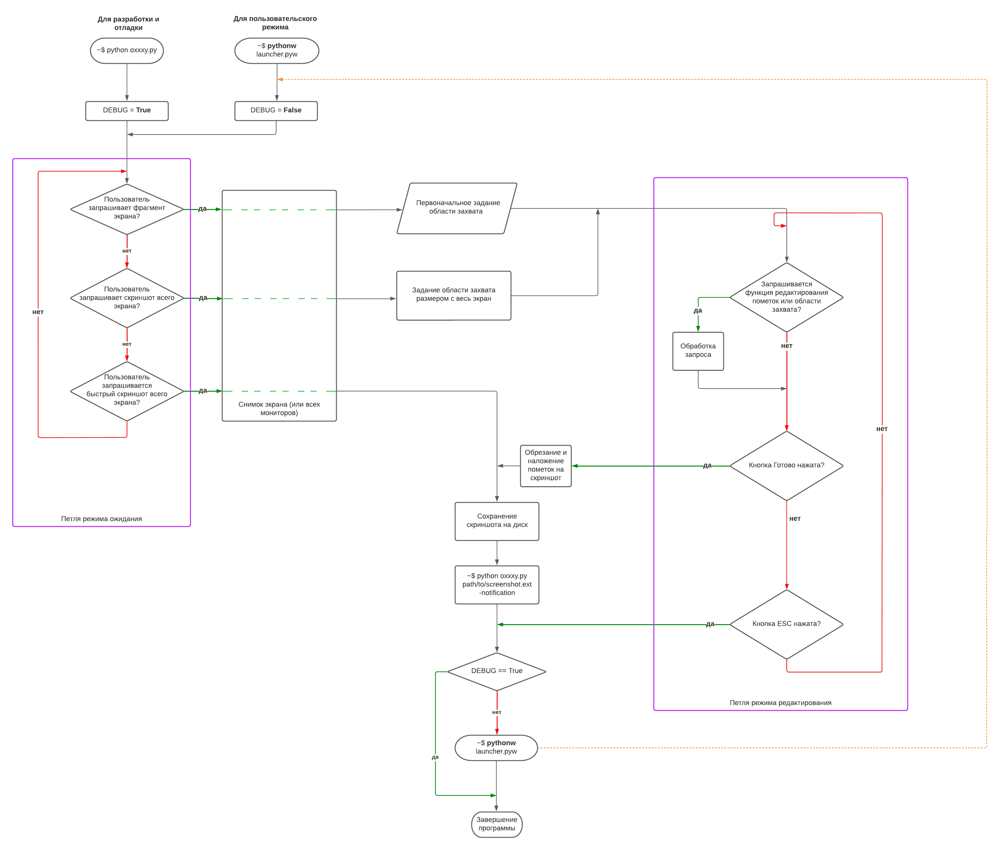
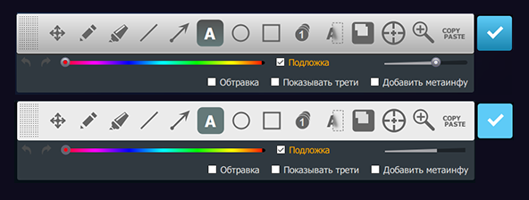

## Замечания

### Файл `start_editor.pyw`

Позволяет сразу запустить редактор скриншота и не отслеживает нажатие горячих клавиш. После успешного создания скриношта покажет информационное окно около трея. Перезапускаться, то есть висеть в трее — не будет. Этот файл нужен был для одного хитрого дела — создания скриншотов самого скриншотера Oxxxy.

### Режим дебага

Запуск файла с расширением **.pyw** не даёт Python-у создать совсем ненужное в пользовательском режиме консольное окно, которое потребуется только при разработке.

При разработке/доработке/отладке нужно запускать `oxxxy.py` — файл с расширением **.py**. Во вспомогательных функциях `request_fullscreen_capture_region` и `request_elements_debug_mode` заданы необходимые режимы для упрощения и ускорения процесса отладки. Также обратите внимание откуда они вызываются в коде. Все эти вызовы можно закомментировать при необходимости.

Если выставить переменную `DEBUG_ELEMENTS = True`, то после запуска файла `oxxxy.py` на экране сразу появится панель пометок и эффектов с предзаданной областью захвата. 
  
В режиме дебага (`DEBUG = True`) слева от захваченной области появляется список элементов (пометок+эффектов), а справа от неё будет выводится предварительный финальный результат, который будет сохранён после нажатия кнопки **Готово**. Этот предварительный результат обновляется только когда кнопка мыши отпускается.

### Упрощённая схема режимов работы



### Варианты выбора момента перезапуска для повторного вхождения в режим ожидания

- *когда приложение вошло в режим редактирования*. Этот вариант даёт запускать сколь угодно много редакторов при этом уже находясь в редакторе;
- *когда приложение вышло из режима редактирования ПЕРЕД сохранением картинки на диск*. Этот вариант позволяет перезагрузить сразу без ожидания сохранения на диск;
- ***когда приложение сохранило картинку на диск или произошла отмена***. Текущий вариант.

### Информация о крашах

После каждого краша *в режиме дебага* в корневую папку приложения в файл `crush.log` будет скопирован Python-овский трейсбэк. После его прочтения сразу будет понятно что, как и где навернулось. Так программисту легче понять что произошло, а пользователям легче зарепортить баг, просто отправив программисту этот файл. Новые краши не стирают информацию о старых крашах в файле.

В пользовательском режиме файл `oxxxy_crush.log` будет лежать в папке текущего пользователя. Просмотреть его можно будет через специальную кнопку в меню трея — она появится, если этот файл есть и только после краша программы:


### Файл настроек `settings.json`

В режиме дебага файл хранится в корневой папке приложения, к которой у скрипта должен быть доступ на чтение и запись. Для изменения расположения потребуется править метод `__init__` класса `SettingsJson` в файле `_utils.py`

В пользовательском режиме файл `oxxxy_settings.json` будет лежать в папке текущего пользователя.

### Иконки панели инструментов

Все эти иконки создаются на старте с помощью кода и не загружаются из файлов. Они завязаны на один и тот же размер в пикселях, а это значит, что увеличивать их размер можно только через увеличение уже созданной картинки, хранящейся в памяти.

### Иконка в трее

Категорически запрещается удалять из корневой папки приложения файл `icon.png`, переименовывать или перемещать его, если вы не понимаете что делаете, и вообще хотите увидеть иконку приложения в трее и вырубать приложение через неё, а не через Диспетчер задач.

### Не баг, а фича

Изначально курсор отрисовывался белым цветом с прозрачностью 50%, но после продолжительного использования программы было решено сделать так, чтобы при движении курсор переливался красным, зелёным и голубым, дабы зрительно на фонах разного цвета его можно было легко отслеживать, в том числе и на белом фоне скриншота, а также, например, во время работы приложения для защиты глаз f.lux.

### Flat Design для панели инструментов

В файле `oxxxy.py` есть переменная `FLAT_EDITOR_UI`. Если выставить её в `True`, то с панели инструментов исчезнут градиенты и прочие украшательства:



## Рекомендуемые параметры для Pylint

```
pylint _utils.py --disable=E0611,C0115,C0103,C0116
pylint oxxxy.py --disable=E0611,C0115,C0103,C0116
```

Для проверки кода можно запускать `run_pylint.bat`.

## Попытки протестить прогу на разных Линуксах в ограниченное время (10 декабря 2022)

### Fedora (версия от 2021 года)

Старый ноут с Fedora был в пределах досягаемости и я решил поэкспериментировать.

Сначала не захотел устанавливаться модуль **pynput**, но я решил [проблему](https://stackoverflow.com/questions/21530577/fatal-error-python-h-no-such-file-or-directory) с помощью команды
```
sudo dnf install python3-devel
```
Уже потом, запустив Oxxxy при импорте модуля **pynput** Python рассыпался на множественные эксепшены, среди которых по-английски было написано, что платформа не поддерживается. В итоге **Oxxxy** всё-таки удалось запустить, предварительно выпилив все связи с **pynput** — таким образом возможность отслеживания нажатия сочетаний клавиш полностью отвалилась на Fedora.
И кстати, трея для иконок приложений в Fedora изначально нет. Поэтому так как посредством трея и сочетаний клавиш редактор скриншота не вызвать, то пришлось запускать ***Oxxxy*** прописав в коносли `python start_editor.pyw`.

При первом запуске возник единственный гейзен-баг — снимок в редакторе содержал непонятный глитч-мусор вместо изображения. Со второго раза баг куда-то пропал. Функция "Переснять скриншот" из контестного меню работала неправильно, а именно: был захвачен интерфейс самого скриншотера, чего быть не должно, ведь он должен быть скрыт на момент пересъёмки.

В остальном все тулзы панели инструментов отрабатывали как и должны. 

### Другие Линухи: Linux Mint 21 Cinnamon, Linux Ubuntu 22.04, Linux Mint 21 Xfce

- чтобы некоторые кнопочки работали под Linux вот это `os.startfile` надо будет заменить на это
```python
      import os, sys, subprocess
      def open_file(filename):
          if sys.platform == "win32":
              os.startfile(filename)
          else:
              opener = "open" if sys.platform == "darwin" else "xdg-open"
              subprocess.call([opener, filename])
```        
- про `explorer.exe` Linux тоже ничего не знает, хотя это очевидно, я просто недоглядел
- нигде не работают отслеживаемые сочетания клавиш, а по некоторым срабатывают встроенные скриншотеры
- на Linux Mint 21 Cinnamon по правому клику в трее выскикивает непонятный белый столб вместо окна, и в процедуру обработки клика по иконке в трее даже не передаётся управление
- в Ubuntu под виртуалкой консоль открыться не смогла, в итоге я не стал разбираться с причиной и забил на Ubuntu
- Linux Mint 21 Xfce внезапно не поддерживается модулем pynput, стало известно только при запуске приложения
- везде, кроме Ubuntu, `start_editor.pyw` работал исправно
- позже всё-таки удалось решить проблемы с Ubuntu. PyQt5 пришлось устаналивать специально и не только для Python, а вообще фундаметально для всей системы и тогда прога начала запускаться. Иконка появилась в системном трее, но была совершенно некликабельна и [эта проблема существует уже давно](https://forum.qt.io/topic/108053/qsystemtrayicon-signals-not-emitting-on-mouse-click-in-ubuntu-19-04), но всем просто насрать и размазать. `start_editor.pyw` запустился, но с серьёзным глюком отрисовки, а вместо скриншота была чернота. Даже запуск из под root не развеял черноту.  

#### Итоги вылазки на Linux

Linux ясно дал мне понять, что мой скриншотер ему не нужен и что PyQt, к сожалению, оказался не таким уж и кроссплатформенным и, получается, что полноценно работает только на Windows. Pynput тоже удивил. Хотя до этого я полагал, что всё пойдёт как по маслу.

Ну что же, оставим на потом версию для Linux и проблемы всех его многочисленных оболочек.
