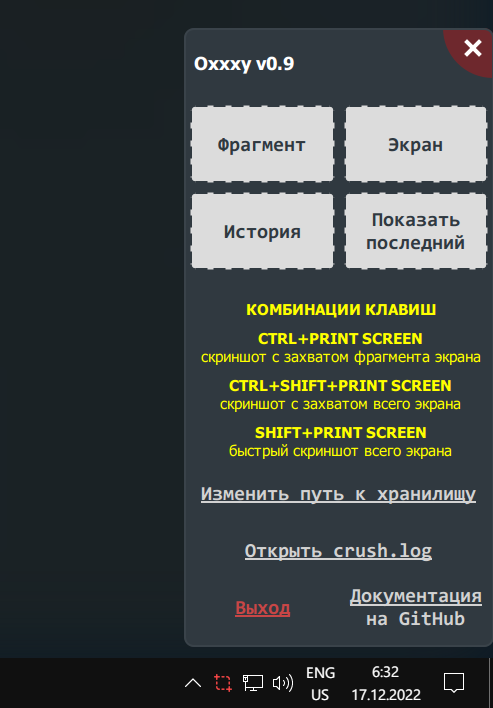

## Установка, запуск приложения и описание возможностей

Начать пользоваться Oxxxy очень просто, если немножко умееть работать с консолью Windows и устанавливать Python-модули через pip.

Для начала работы нет необходимости где-то регистрироваться, нужно только установить Python, PyQt5 и ряд других зависимостей, описанных в файле `install_deps.bat`.
Устанавливая Python нужно обязательно прожать галочку около пункта "Add Python X.XX to PATH", иначе проблемы с установкой зависимостей придётся решать вручную 

~Когда все зависимости будут установлены, нужно убедиться, что корневая папка приложения позволяет создавать, читать и писать файлы из неё - это скорее для тех, кто запускает программу на Linux.~ Затем нужно запустить файл `launcher.pyw` — теперь в правом нижнем углу экрана в трее должна появится иконка Oxxxy:

Левым кликом мыши по иконке в трее можно моментально сделать скриншот области экрана.
Затем программа попросит выделить нужную область экрана зажав левую кнопку мыши:

После этого появится панель инструментов, которая поможет нанести на скриншот необходимые пометки:

Инструмент **Карандаш** позволяет рисовать кривые, инструмент **Маркер** — выделять главное, а инструмент **Линия** — прямые линии. **Стрелка** рисует стрелочки, которые помогут указать на особо важные объекты на скриншоте.
Инструмент **Текст** позволяет писать необходимую информацию на скриншоте.
А инструменты **Овал** и **Прямоугольник** позволяют выделять важные элементы соответствующими фигурами.
**Размытие** позволит скрыть конфиденциальную информацию, которая содержится на скриншоте.
Инструментом **Нумерация** можно пронумеровать необходимые элементы скриншота.
**Затемнение** позволит затемнять невыделенную этим инструментом часть изображения.

Существует и инструмент **Перемещение**, который с помощью специального виджета позволит трансформировать и перемещать любые эффекты от инструментов уже использованных на скриншоте.

Кроме этого, всегда есть возможность изменить размер захваченной области экрана для скриншота, потянув её за края или углы.

В этой версии нет инструмента, который бы позволил сделать скриншот страницы с прокруткой. И в будущем его не будет.

В этой неофициальной опенсорсной версии появилось три новых инструмента - **Штамп, Лупа и Копипейст**. 
Инструмент **Штамп** помогает размещать стикеры и динамически сгенерированные картинки (созданные через python-скрипт) и даже картинки из буфера обмена, загружаемые в инструмент через сочетание **Ctrl+V**.
Инструмент **Лупа** даёт увеличивать необходимые области изображения и размещать увеличенную копию в любом месте.
Инструмент **Копипейст** даёт копипастить куски изображения без масштабирования в любое место.

Также есть цветовая палитра, которая позволяет выбирать цвет для инструментов рисования, и ещё есть ползунок, настраивающий толщину линии или что-нибудь другое в зависимости от назначения инструмента.

Новые пометки будут иметь те цвет и толщину/размер (или интенсивность - для эффектов), которые были выставлены под конкретный инструмент для создания пометки или эффекта.

Когда редактирование закончено, осталось лишь нажать на кнопку **Готово** сбоку панели инструментов или нажать **Enter**. Программа один раз попросит выбрать место, которое запомнит, и в которое впредь будет складывать все сделанные скриншоты.

После сохранения справа внизу экрана появится окошко, в котором можно открыть скриншот в браузере или в просмотрщике изображений по-умолчанию. Кроме этого в буфер будет скопировано само изображение, чтобы потом вставлять его через сочетание **Ctrl+V** где потребуется. 

Кликнув правой кнопкой мыши по иконке Oxxxy в трее в правом нижнем углу экрана, вы получаете доступ к меню программы, из которого можно так же сделать скриншот выделенной области экрана, скриншот всего экрана и получить быстрый доступ к последнему созданному скриншоту:

### Как добавить приложение Oxxxy в автозагрузку Windows?

 ***Начиная с версии 0.92 это можно проделать через настройки приложения***

 1) нажать сочетание **Win + R**, в появившемся поле вбить `shell:startup`, нажать **Enter**;
 2) откроется папка, в которой надо разместить ярлык для файла `launcher.pyw`;
 3) вы восхитительны: теперь приложение будет запускаться при запуске системы.

### Возможные и известные проблемы и ограничения текущей версии

- в нестандартных конфигурациях мониторов могут быть проблемы, если у мониторов настроены разные разрешения или мониторы не расположены в общем координатном пространстве в один ряд/столбец друг относительно друга
- в Канадской многоязычной раскладке для Windows сочетания клавиш работают **только с левым Ctrl**. Это неудобно, поэтому начиная с версии 0.92 можно вдобавок вызывать скриншотер через единственную клаишу **Print Screen**
- изначально программа писалась на Python 3.7, но с переходом на версию Python 3.10 появилась проблема, а именно `QPoint` и `QRect` рассыпались на эксепшены при попытке подсунуть им `float` вместо `int`, хотя раньше глотали как миленькие. Везде, где прога падала, было прописано явное приведение `float`-ов `int`-ам или вызов функций `.toPoint()` и `.toRect()` и проблема, вроде бы, ушла
- порой появившись на экране, редактор скриншота не получает фокуса ввода, и клавиши F1 и Esc не срабатывают, пока хоть раз не кликнешь кнопкой мыши в любом месте редактора. Это связано с ограничениями самой Windows, а точнее с работой функции SetForegroundWindow — [по ссылке](https://learn.microsoft.com/en-us/windows/win32/api/winuser/nf-winuser-setforegroundwindow#remarks) вся подноготная этой темы.
- инструменты **Штамп** и **Текст** поддерживают повороты только при создании, но не при редактировании через виджет трансформации (при использовании инструмента Перемещение). При этом сами виджеты трансформации пока ещё не поворачиваются на тот же угол, что и пометки, т.е. не согласуются по углу поворота
- при редактировании пометок **Текст** иногда вылезают гейзенбаги, когда текстовая часть почему-то дублируется или не переносится за стрелкой. Чётко вопроизвести баг не удаётся, проблема будет решена в будущих версиях через анализ всего кода, отвечающего за пометки **Текст** и инструмент **Перемещение**
- сочетания клавиш для вызова редактора не работают, если Диспетчер задач отображается поверх всех окон в Windows 10. Нужно либо сначала скрыть Диспетчер задач и потом нажать сочетание клавиш, либо вызвать скриншотер щелкнув левой кнопкой мыши по иконке в трее. Начиная с версии 0.92 можно делать скриншоты Диспетчера задач только через пункт  «Переснять скриншот» контекстного меню редактора скриншотов

### Режим первоначального задания области захвата и режим редактирования пометок

До и для появления панели инструментов вам нужно первоначально задать область захвата, отсюда и название режима. Область захвата всегда можно будет поправить и позже. До появления панели инструментов в этом режиме задания области захвата доступна лупа и справка через клавишу F1.
Текст этой справки приводится здесь:
- В режиме задания области захвата с помощью левой кнопки мыши доступны следующие модификаторы: если зажать Shift, то область захвата будет строго квадратной при любых движениях курсора мыши, если зажать Ctrl, то приращение/суживание области захвата при движениях мыши будет шаговым.
- Стрелки ← ↑ → ↓ помогут позиционировать курсор с точностью до пикселя без участия мыши, доступные модификаторы: Shift — перемещение на 10 пикселей, а не на 1; Ctrl — умножает текущую величину перемещения на 5. Нажатие на клавишу Enter позволяет подтвердить ввод позиций начального и конечного углов прямоугольной области захвата.
- В режиме задания области захвата доступна лупа для более точного прицеливания, колесом мыши можно задавать её размер. 
- В режиме задания области захвата комбинация Ctrl + C позволяет копировать цвет под прицелом лупы в буфер обмена, например, для одного цвета в буфере появится текстовая строка `#f8f8f0 rgb(248, 248, 240)`. Есть возможность копировать в буфер более более чем одно значение цвета не перезапуская сто раз приложение — в таком случае просто надо продолжать нажимать Ctrl + C, когда прицел лупы будет над нужным цветом. Все отобранные таким образом цвета будут в буфере, а из приложения можно будет выйти, отменив создание скриншота через **Esc**, и затем скопировать из буфера цвета куда нужно.

В режиме редактирования пометок и в режиме первоначального задания области захвата доступно контекстное меню для возможности выхода из приложения или сворачивания окна или для того, чтобы переснять скриншот заново не выходя из программы.

Вдобавок к этому через **Tab / Tab+Shift** всегда можно переключаться между 3-мя режимами отображения незахваченных областей:
- **незахваченные области отображают то, что было на экране на момент вызова скриншотера. Этот режим активируется при запуске редактора** 
- в незахваченных областях отображается микс того, чтобы было при вызове и того, что в данный момент окна приложений под редактором скриншотера выводят на экран 
- незахваченная область полностью прозрачна и отображает то, что происходит в окнах приложений под редактором скриншотера

Это может быть очень полезно при продолжительной работе над скриншотом или при работе на двух мониторах.

### Подробнее о режиме ожидания и о том, что будет после создания скриншота

После запуска файла `launcher.pyw` скриншотер присаживается в трей и входит в режим ожидания, который можно прервать через:
- сочетание Ctrl+PrintScr или просто PrintScr (сделать скриншот фрагмента),
- сочетание Ctrl+Shift+PrintScr (сделать скриншот всего экрана или всех экранов),
- сочетание Shift+PrintScr (быстрый скриншот всего экрана или всех экранов без запуска редактора),
- иконку в трее левой кнопкой мыши,
- кнопки окна, вызывающегося из трея по клику правой кнопки мыши. 

После сохранения в правом нижнем углу будет показано вспомогательное окно для быстрого обращения к скриншоту (если не было отмены). После отмены создания скриншота или после успешного сохранения скриншота, Oxxxy сразу сам себя перезапускает и снова оказывается в трее и входит в режим ожидания. Такое решение было принято для того, чтобы избежать утечек памяти, чтобы автору было проще его программировать и чтобы пользователю выпадало меньше багов при использовании.

### Обтравка кружком и шестигранником, метаинформация, трети

При включённой галочке *Обтравка* к финальному результату будет применена обтравка маской в виде кружка.
При желании может быть использована вторая маска для обтравки — шестигранник. Для переключения между масками надо нажать клавишу латинской буквы **H**.

Галочка *Показывать трети* существует для надобностей перфекционистов. Трети видно только в режиме редактирования, в финальном скриншоте они не отображаются.

При включённой галочке *Добавить метаинформацию* в финальный png-файл будет добавлена метаинформация с названием заголовка активного окна на момент вызова скриншотера.

### Стикеры и динамические штампы

- наборы стикеров надо складывать в папку `stamps\stickers`. Любой тематический набор лучше оформить в отдельную подпапку;
- одинокие картинки не объединённые одной темой нужно складывать в папку `stamps\pictures`;
- файл `stamps\python\draw_simple_stamp.py` создан в качестве примера и генерирует штамп с актуальной датой. При желании и знании PyQt5 на основе этого файла можно создать свой штамп, просто скопировав и переименовав файл и изменив код отрисовки. Отлаживать такой файл можно не запуская скриншотер, ведь при прямом запуске такого python-файла появляется окно с нарисованным штампом. Далее, если были соблюдены все условности, python-файл будет обнаружен скриншотером и штампы из такого python-файла появятся в контекстном меню инструмента **Штамп**.
