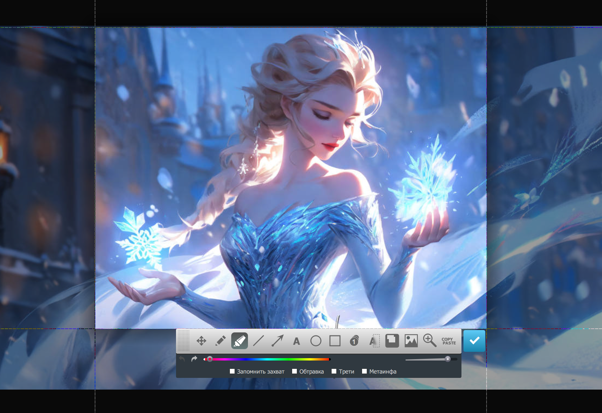

# [Russian] [PyQt] Oxxxy Screenshoter v0.9 for Windows by Sergei Krumas

**Oxxxy Screenshoter — неофициальный и неполный опенсорсный клон программы Joxi для создания скриншотов с отсебятиной от Сергея Крумаса**

По моему мнению, Oxxxy — лучший инструмент для создания скриншотов когда
- документируешь программное обеспечение под NDA
- ведёшь важные переговоры в сети
- составляешь техническое задание
- начиная с нерелизной версии 0.92 встроен простенький редактор коллажей. И хоть он написан на PyQt, но запускается он все ещё быстерей чем современный Photoshop, который с какой-то стати требует ещё и видеокарточку с минимум 1.5 GB памяти
- при редактировании скриншота и при редактировании коллажа можно управлять зумом и панорамированием, а также поворачивать, масштабировать и перемещать любые объекты - в том числе и сам скриншот
- текущие изменения, ещё не воспетые в документации, можно почитать в файле [Changelog](CHANGELOG.md)

Image by Namakxin

Если у вас возникли какие-либо вопросы или проблемы в работе программы, вы всегда можете описать вашу проблему в специальном разделе Issues. Возможно вам даже помогут, но это неточно. Ведь вы получили этот продукт по условиям GPL, которая ни к чему не обязывает.

## Лицензия

Весь исходный код выпущен под GNU GPL Version 2

## Мотивировка

Зачем, а главное — nahuya я написал копию популярного скриншотера и назвал его Oxxxy? Причины следующие:
- оригинальный скриншотер Joxi сразу посылает все созданные скриншоты на свой сервак, что очень удобно для обычных пользователей сети делящихся скриншотами с другими пользователями. Но это совсем недопустимо, когда ты как разработчик пользуешься им на работе и подписываешь всякие там NDA или что-то подобное. Сохранение скриншота на компьютер в Joxi конечно реализовано, но программа каждый раз спрашивает место для сохранения файла, что уже давно вымораживало;
- при частом использовании Joxi падает;
- патчить недостатки Joxi побайтово и раздавать пропатченную версию всем моим корешам/корешессам является незаконным в РФ, ЕС и США;
- возможность спонтанно добавлять в программу инструменты для нужных пометок и эффектов. При написании документации к разрабатываемому софту именно нанесение пометок является очень рутинным делом. Поэтому постоянно назревала идея облегчить мучения за счёт своих навыков программирования и доступного исходного кода, который теперь существует в природе и доступен не мне одному;
- наносить пометки в тяжеловестных приложениях типа Photoshop или GIMP долго и утомительно;
- нужен был проект для углублённого изучения PyQt;
- ещё будучи неготовой для публичного релиза прога часто пригождалась в личных и важных переговорах.

## Языки интерфейса

- только Русский

## Требования

- Операционная система: Windows 8.1 или Windows 10. На Windows 11 не тестировалось, на Linux в данный момент пользоваться невозможно (подробности ниже в специальном разделе)
- Уметь самостоятельно установить Python нужной версии и работать с командной строкой для установки зависимостей через поставляемую с Python утилиту **pip**
- Версия Python 3.10.6 и выше.
- Установка всех зависимостей через утилиту **pip**, прописанных в файле **install_dependencies.bat**

## [Установка, запуск приложения и описание возможностей](OVERVIEW.md)

## [Changelog](CHANGELOG.md)

## Доработка или исправление багов

Перед началом доработок или исправлений багов необходимо прочитать все исходники и файлы [Ручное тестирование и рефакторинг](MANUAL_TESTING.md) и [Changelog](CHANGELOG.md)
Это необходимо для того, чтобы не изобретать то, что уже есть, тщательно продумывать идею и реализацию и не плодить дополнительных багов.

## Порядок действий при выходе новой версии

Каждая версия программы может либо быть релизной, либо не быть.
Релизную версию отличает то, что она прошла рукопашное тестирование и исправление возможных багов.
Уточнить была ли версия релизной можно в [Changelog](CHANGELOG.md)

1) (для релизной версии) провести рукопашный тест по списку в файле [Ручное тестирование](MANUAL_TESTING.md) и исправить баги, если они обнаружены
2) прописать изменения в версии в файле [Changelog](CHANGELOG.md) с добавлением картиночек
3) прочитать всю документацию и внести правки, если потребуется
4) после теста сделать коммит с повышеной версией специально для релиза
5) поставить тэг на коммит, название для тега Oxxxy-Version-X.XX, где X.XX заменяется на текущую версию

## [Заметки](NOTES.md)

## [Ручное тестирование и рефакторинг](MANUAL_TESTING.md)
