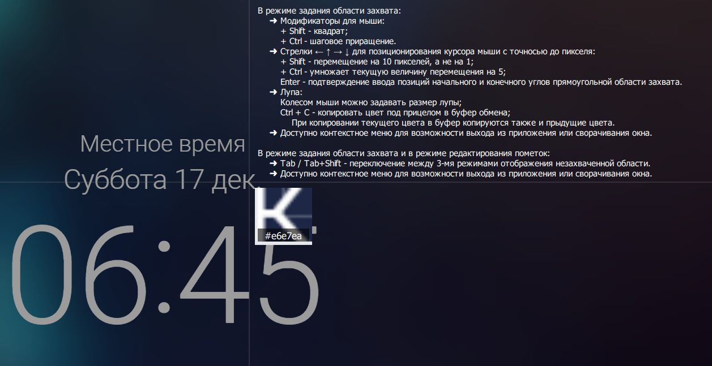
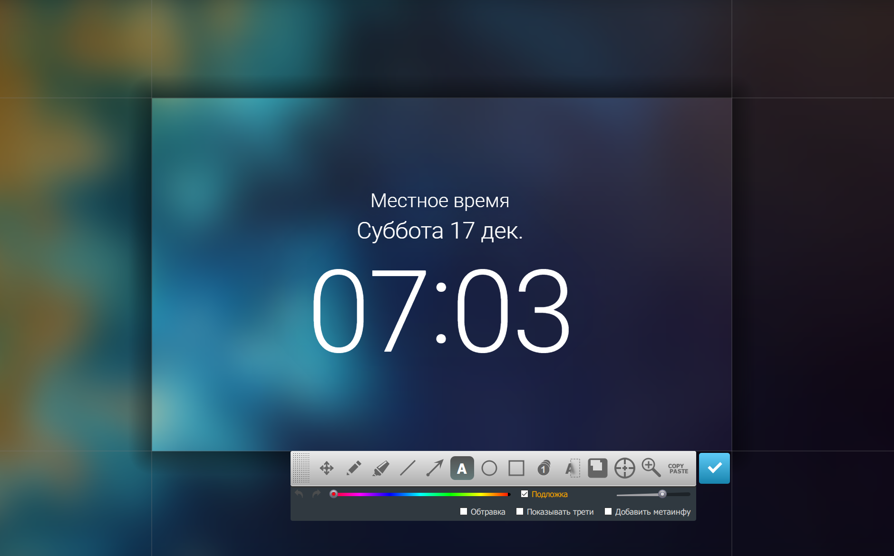
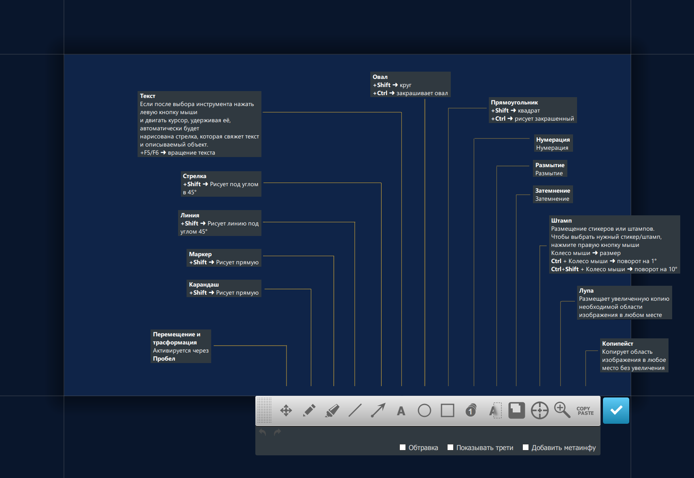
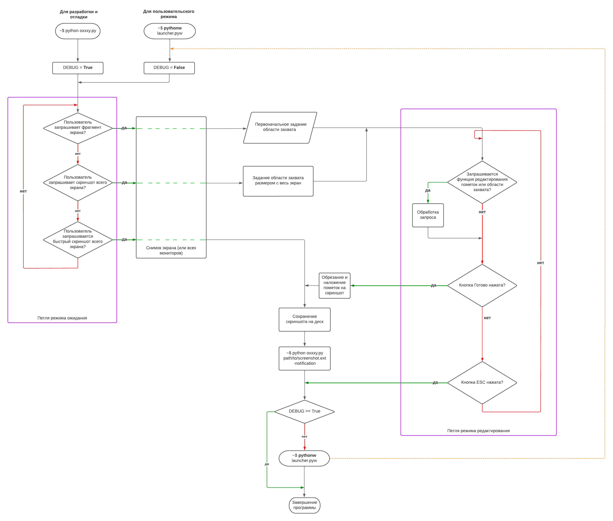
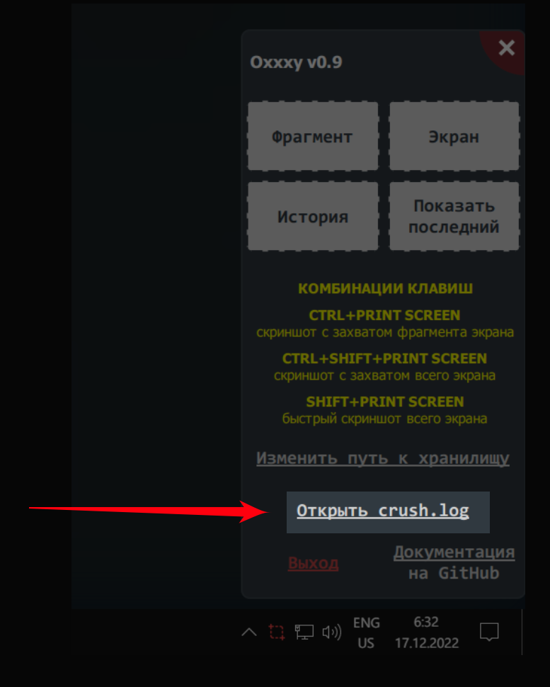

# [Russian] Oxxxy Screenshoter v0.9 for Windows by Sergei Krumas


**Oxxxy Screenshoter — неофициальный и неполный опенсорсный клон программы Joxi для создания скриншотов с отсебятиной от Сергея Крумаса**

## Спасибо, что выбрали Oxxxy!

По моему мнению, Oxxxy — лучший инструмент для создания скриншотов когда
- документируешь программное обеспечение под NDA
- ведёшь важные переговоры в сети
- составляешь техническое задание

Если у вас возникли какие-либо вопросы или проблемы в работе программы, вы всегда можете описать вашу проблему в специальном разделе Issues. Возможно вам даже помогут, но это неточно. Ведь вы получили этот продукт по условиям GPL, которая ни к чему не обязывает.

## Лицензия

Весь исходный код выпущен под GNU GPL Version 2

## Мотивировка

Зачем, а главное — nahuya я написал копию популярного скриншотера и назвал его Oxxxy? Причины следующие:
- оригинальный скриншотер Joxi сразу посылает все созданные скриншоты на свой сервак, что очень удобно для обычных пользователей сети делящихся скриншотами с другими пользователями. Но это совсем недопустимо, когда ты как разработчик пользуешься им на работе и подписываешь всякие там NDA или что-то подобное. Сохранение скриншота на компьютер в Joxi конечно реализовано, но программа каждый раз спрашивает место для сохранения файла, что уже давно вымораживало;
- при частом использовании Joxi падает;
- патчить недостатки Joxi побайтово и раздавать пропатченную версию всем моим корешам/корешессам является незаконным в РФ, ЕС и США;
- возможность спонтанно добавлять в программу инструменты для нужных пометок и эффектов. При написании документации к разрабатываемому софту именно нанесение пометок является очень рутинным делом. Поэтому постоянно назревала идея облегчить мучения за счёт своих навыков программирования и доступного исходного кода, который теперь существует в природе и доступен не мне одному;
- наносить пометки в тяжеловестных приложениях типа Photoshop или GIMP долго и утомительно;
- нужен был проект для углублённого изучения PyQt;
- ещё будучи неготовой для публичного релиза прога часто пригождалась в личных и важных переговорах.

## Языки интерфейса

- только Русский

## Требования

- Операционная система: Windows 8.1 или Windows 10. На Windows 11 не тестировалось, на Linux в данный момент пользоваться невозможно (подробности ниже в специальном разделе)
- Уметь самостоятельно установить Python нужной версии и работать с командной строкой для установки зависимостей через встроенную в Python утилиту **pip**
- Версия Python: 3.10.6 и выше.
- Установка всех зависимостей через утилиту **pip**, прописанных в файле **install_deps.bat**

### Зависимости
ВАЖНО: Необходимо, чтобы pynput обязательно был именно указанной здесь версии, ибо в 1.7.6 он почему-то не распознаёт нажатие на клавишу Print Screen и, собственно, поэтому все горячие клавиши работать не будут ВОЩЕ. Зарепортить баг мне было лень, поэтому я просто поставил старую версию, хехе.
Вдобавок пользователям Linux хорошо было бы ознакомится с этим https://pynput.readthedocs.io/en/latest/limitations.html

## Установка, запуск приложения и описание возможностей

Начать пользоваться Oxxxy очень просто, если немножко умееть работать с консолью Windows и устанавливать Python-модули через pip.

Для начала работы нет необходимости где-то регистрироваться, нужно только установить Python, PyQt5 и ряд других зависимостей, описанных в файле `install_deps.bat`.
Устанавливая Python нужно обязательно прожать галочку около пункта "Add Python X.XX to PATH", иначе проблемы с установкой зависимостей придётся решать вручную 

~Когда все зависимости будут установлены, нужно убедиться, что корневая папка приложения позволяет создавать, читать и писать файлы из неё - это скорее для тех, кто запускает программу на Linux.~ Затем нужно запустить файл `launcher.pyw` — теперь в правом нижнем углу экрана в трее должна появится иконка Oxxxy:


Левым кликом мыши по иконке в трее можно моментально сделать скриншот области экрана.
Затем программа попросит выделить нужную область экрана зажав левую кнопку мыши:



После этого появится панель инструментов, которая поможет нанести на скриншот необходимые пометки:



Инструмент **Карандаш** позволяет рисовать кривые, инструмент **Маркер** — выделять главное, а инструмент **Линия** — прямые линии. **Стрелка** рисует стрелочки, которые помогут указать на особо важные объекты на скриншоте.
Инструмент **Текст** позволяет писать необходимую информацию на скриншоте.
А инструменты **Овал** и **Прямоугольник** позволяют выделять важные элементы соответствующими фигурами.
**Размытие** позволит скрыть конфиденциальную информацию, которая содержится на скриншоте.
Инструментом **Нумерация** можно пронумеровать необходимые элементы скриншота.
**Затемнение** позволит затемнять невыделенную этим инструментом часть изображения.

Существует и инструмент **Перемещение**, который с помощью специального виджета позволит трансформировать и перемещать любые эффекты от инструментов уже использованных на скриншоте.



Кроме этого, всегда есть возможность изменить размер захваченной области экрана для скриншота, потянув её за края или углы.

В этой версии нет инструмента, который бы позволил сделать скриншот страницы с прокруткой. И в будущем его не будет.

В этой неофициальной опенсорсной версии появилось три новых инструмента - **Штамп, Лупа и Копипейст**. 
Инструмент **Штамп** помогает размещать стикеры и динамически сгенерированные картинки (созданные через python-скрипт) и даже картинки из буфера обмена, загружаемые в инструмент через сочетание **Ctrl+V**.
Инструмент **Лупа** даёт увеличивать необходимые области изображения и размещать увеличенную копию в любом месте.
Инструмент **Копипейст** даёт копипастить куски изображения без масштабирования в любое место.

Также есть цветовая палитра, которая позволяет выбирать цвет для инструментов рисования, и ещё есть ползунок, настраивающий толщину линии или что-нибудь другое в зависимости от назначения инструмента.

Новые пометки будут иметь те цвет и толщину/размер (или интенсивность - для эффектов), которые были выставлены под конкретный инструмент для создания пометки или эффекта.

Когда редактирование закончено, осталось лишь нажать на кнопку **Готово** сбоку панели инструментов или нажать **Enter**. Программа один раз попросит выбрать место, которое запомнит, и в которое впредь будет складывать все сделанные скриншоты.

После сохранения справа внизу экрана появится окошко, в котором можно открыть скриншот в браузере или в просмотрщике изображений по-умолчанию. Кроме этого в буфер будет скопировано само изображение, чтобы потом вставлять его через сочетание **Ctrl+V** где потребуется. 


Кликнув правой кнопкой мыши по иконке Oxxxy в трее в правом нижнем углу экрана, вы получаете доступ к меню программы, из которого можно так же сделать скриншот выделенной области экрана, скриншот всего экрана и получить быстрый доступ к последнему созданному скриншоту:


### Как добавить приложение Oxxxy в автозагрузку Windows?

 1) нажать сочетание **Win + R**, в появившемся поле вбить `shell:startup`, нажать **Enter**;
 2) откроется папка, в которой надо разместить ярлык для файла `launcher.pyw`;
 3) вы восхитительны: теперь приложение будет запускаться при запуске системы.


### Возможные и известные проблемы и ограничения текущей версии

- в нестандартных конфигурациях мониторов могут быть проблемы, если у мониторов настроены разные разрешения или мониторы не расположены в общем координатном пространстве в один ряд/столбец друг относительно друга
- в Канадской многоязычной раскладке для Windows сочетания клавиш работают **только с левым Ctrl**
- изначально программа писалась на Python 3.7, но с переходом на версию Python 3.10 появилась проблема, а именно `QPoint` и `QRect` рассыпались на эксепшены при попытке подсунуть им `float` вместо `int`, хотя раньше глотали как миленькие. Везде, где прога падала, было прописано явное приведение `float`-ов `int`-ам или вызов функций `.toPoint()` и `.toRect()` и проблема, вроде бы, ушла
- порой появившись на экране, редактор скриншота не получает фокуса ввода, и клавиши F1 и Esc не срабатывают, пока хоть раз не кликнешь кнопкой мыши в любом месте редактора. Это связано с ограничениями самой Windows, а точнее с работой функции SetForegroundWindow — [по ссылке](https://learn.microsoft.com/en-us/windows/win32/api/winuser/nf-winuser-setforegroundwindow#remarks) вся подноготная этой темы.
- инструменты Штамп и Текст поддерживают повороты только при создании, но не при редактировании через виджет трансформации (при использовании инструмента Перемещение). При этом сами виджеты трансформации пока ещё не поворачиваются на тот же угол, что и пометки, т.е. не согласуются по углу поворота
- при редактировании пометок Текст иногда вылезают гейзенбаги, когда текстовая часть почему-то дублируется или не переносится за стрелкой. Чётко вопроизвести баг не удаётся, проблема будет решена в будущих версиях через анализ всего кода, отвечающего за пометки Текст и инструмент Перемещение
- сочетания клавиш для вызова редактора не работают, если Диспетчер задач отображается поверх всех окон в Windows 10. Нужно либо сначала скрыть Диспетчер задач и потом нажать сочетание клавиш, либо вызвать скриншотер щелкнув левой кнопкой мыши по иконке в трее.  


### Режим первоначального задания области захвата и режим редактирования пометок

До и для появления панели инструментов вам нужно первоначально задать область захвата, отсюда и название режима. Область захвата всегда можно будет поправить и позже. До появления панели инструментов в этом режиме задания области захвата доступна лупа и справка через клавишу F1.
Текст этой справки приводится здесь:
- В режиме задания области захвата с помощью левой кнопки мыши доступны следующие модификаторы: если зажать Shift, то область захвата будет строго квадратной при любых движениях курсора мыши, если зажать Ctrl, то приращение/суживание области захвата при движениях мыши будет шаговым.
- Стрелки ← ↑ → ↓ помогут позиционировать курсор с точностью до пикселя без участия мыши, доступные модификаторы: Shift — перемещение на 10 пикселей, а не на 1; Ctrl — умножает текущую величину перемещения на 5. Нажатие на клавишу Enter позволяет подтвердить ввод позиций начального и конечного углов прямоугольной области захвата.
- В режиме задания области захвата доступна лупа для более точного прицеливания, колесом мыши можно задавать её размер. 
- В режиме задания области захвата комбинация Ctrl + C позволяет копировать цвет под прицелом лупы в буфер обмена, например, для одного цвета в буфере появится текстовая строка `#f8f8f0 rgb(248, 248, 240)`. Есть возможность копировать в буфер более более чем одно значение цвета не перезапуская сто раз приложение — в таком случае просто надо продолжать нажимать Ctrl + C, когда прицел лупы будет над нужным цветом. Все отобранные таким образом цвета будут в буфере, а из приложения можно будет выйти, отменив создание скриншота через **Esc**, и затем скопировать из буфера цвета куда нужно.

В режиме редактирования пометок и в режиме первоначального задания области захвата доступно контекстное меню для возможности выхода из приложения или сворачивания окна или для того, чтобы переснять скриншот заново не выходя из программы.

Вдобавок к этому через **Tab / Tab+Shift** всегда можно переключаться между 3-мя режимами отображения незахваченных областей:
- **незахваченные области отображают то, что было на экране на момент вызова скриншотера. Этот режим активируется при запуске редактора** 
- в незахваченных областях отображается микс того, чтобы было при вызове и того, что в данный момент окна приложений под редактором скриншотера выводят на экран 
- незахваченная область полностью прозрачна и отображает то, что происходит в окнах приложений под редактором скриншотера

Это может быть очень полезно при продолжительной работе над скриншотом или при работе на двух мониторах.

### Подробнее о режиме ожидания и о том, что будет после создания скриншота

После запуска файла `launcher.pyw` скриншотер присаживается в трей и входит в режим ожидания, который можно прервать через :
- сочетание Ctrl+PrintScr (сделать скриншот фрагмента),
- сочетание Ctrl+Shift+PrintScr (сделать скриншот всего экрана или всех экранов),
- сочетание Shift+PrintScr (быстрый скриншот всего экрана или всех экранов без запуска редактора),
- иконку в трее левой кнопкой мыши,
- кнопки окна, вызывающегося из трея по клику правой кнопки мыши. 

После сохранения в правом нижнем углу будет показано вспомогательное окно для быстрого обращения к скриншоту (если не было отмены). После отмены создания скриншота или после успешного сохранения скриншота, Oxxxy сразу сам себя перезапускает и снова оказывается в трее и входит в режим ожидания. Такое решение было принято для того, чтобы избежать утечек памяти, чтобы автору было проще его программировать и чтобы пользователю выпадало меньше багов при использовании.

### Обтравка кружком и шестигранником, метаинформация, трети

При включённой галочке *Обтравка* к финальному результату будет применена обтравка маской в виде кружка.
При желании может быть использована вторая маска для обтравки — шестигранник. Для переключения между масками надо нажать клавишу латинской буквы **H**.

Галочка *Показывать трети* существует для надобностей перфекционистов. Трети видно только в режиме редактирования, в финальном скриншоте они не отображаются.

При включённой галочке *Добавить метаинформацию* в финальный png-файл будет добавлена метаинформация с названием заголовка активного окна на момент вызова скриншотера.

### Стикеры и динамические штампы

- наборы стикеров надо складывать в папку `stamps\stickers`. Любой тематический набор лучше оформить в отдельную подпапку;
- одинокие картинки не объединённые одной темой нужно складывать в папку `stamps\pictures`;
- файл `stamps\python\draw_simple_stamp.py` создан в качестве примера и генерирует штамп с актуальной датой. При желании и знании PyQt5 на основе этого файла можно создать свой штамп, просто скопировав и переименовав файл и изменив код отрисовки. Отлаживать такой файл можно не запуская скриншотер, ведь при прямом запуске такого python-файла появляется окно с нарисованным штампом. Далее, если были соблюдены все условности, python-файл будет обнаружен скриншотером и штампы из такого python-файла появятся в контекстном меню инструмента **Штамп**.

## Changelog
- 0.90 **Первая релизная версия**
- 0.91
  - Инструмент Размытие получил галочку "Пикселизация"
  - Инструмент Линия теперь может рисовать ломанные линии при удерживании клавиши Ctrl. Каждый сегмент линии создаётся как отдельная пометка
- 0.92
  - окно настроек
  - палитра цветов
  - Теперь пометки инструментов Линия, Маркер и Карандаш автоматически удаляются, если совпадают их начальная и конечная точки, потому что в таком случае они всё равно не отрисовывались, но всё-равно оставались в истории действий. Для избежания конфуза при использовании Ctrl+Z в подобных случаях и было внесено это исправление. 

## Что будет в следующих версиях?

- рефакторинг кода
- переход с PyQt5 на PyQt6 
- оформлю программу в отдельный python-модуль для встраивания в любые PyQT-приложения
- будет возможность делать пометки на любых картинках из проводника Windows
- для UI добавятся ещё три языка кроме Русского: Немецкий, Французский и Английский
- переделаю виджет для инструмента **Текст**, чтобы в режиме редактирования при повороте через клавиши F5-F6 одновременно с основной не отображалась повёрнутая версия
- выделение объектов для инструмента **Перемещение** будет реализовано намного аккуратней, а не по bounding box объекта как сейчас
- возможность записывать видео со звуком или гифки в захваченной области
- тест и обеспечение работы в виртуальном окружении
- возможность менять комбинации клавиш. Текущие комбинации очень удачно подобраны, поэтому нет острой необходимости их менять сейчас
- версия приложения в виде единого бинарника для Windows и Linux
- возможность менять размеры шрифтов в интерфейсе

## Интересные факты

- разработка велась исподволь с июня 2021 года по май 2022 года, бетатестирование с мая 2022 по середину декабря 2022
- под конец работы над этим проектом при исследовании файлов скриншотера Joxi внезапно обнаружилось, что он тоже написан с использованием Qt, только уже на C++
- *производительность или зачем писать Qt-приложения на Python*: если б я писал это всё на C++, то, чувствую, что провозился ещё дольше. На Python пробовать, разрабатывать и отлаживать проще, удобней и быстрей. Ну и, если представить меня, автора кода и автора идеи, в виде пары пользователь+программист, то практичный пользователь однозначно взял верх и ему глубоко насрать как оно там внутри, главное ведь работает же! Ну и пока Oxxxy это не то приложение, в котором производительность играет серьёзную роль.
- отличия от оригинала:
   - клон не умеет делать скриншоты с прокруткой
   - созданный скриншот не отравляется никуда, тем более не предусмотрена даже интеграция с каким-либо из облачных сервисов для хранения изображений и файлов
   - нижняя панель под панелью инструментов не скрывается под неё
   - кнопка **Готово** чуть меньшей высоты, чем сама панель инструментов

## Замечания

### Файл `start_editor.pyw`

Позволяет сразу запустить редактор скриншота и не отслеживает нажатие горячих клавиш. После успешного создания скриношта покажет информационное окно около трея. Перезапускаться, то есть висеть в трее — не будет. Этот файл нужен был для одного хитрого дела — создания скриншотов самого скриншотера Oxxxy.

### Режим дебага

Запуск файла с расширением **.pyw** не даёт Python-у создать совсем ненужное в пользовательском режиме консольное окно, которое потребуется только при разработке.

При разработке/доработке/отладке нужно запускать `oxxxy.py` — файл с расширением **.py**. Во вспомогательных функциях `request_fullscreen_capture_region` и `request_elements_debug_mode` заданы необходимые режимы для упрощения и ускорения процесса отладки. Также обратите внимание откуда они вызываются в коде. Все эти вызовы можно закомментировать при необходимости.

Если выставить переменную `DEBUG_ELEMENTS = True`, то после запуска файла `oxxxy.py` на экране сразу появится панель пометок и эффектов с предзаданной областью захвата. 
  
В режиме дебага (`DEBUG = True`) слева от захваченной области появляется список элементов (пометок+эффектов), а справа от неё будет выводится предварительный финальный результат, который будет сохранён после нажатия кнопки **Готово**. Этот предварительный результат обновляется только когда кнопка мыши отпускается.

### Упрощённая схема режимов работы



### Варианты выбора момента перезапуска для повторного вхождения в режим ожидания

- *когда приложение вошло в режим редактирования*. Этот вариант даёт запускать сколь угодно много редакторов при этом уже находясь в редакторе;
- *когда приложение вышло из режима редактирования ПЕРЕД сохранением картинки на диск*. Этот вариант позволяет перезагрузить сразу без ожидания сохранения на диск;
- ***когда приложение сохранило картинку на диск или произошла отмена***. Текущий вариант.

### Информация о крашах

После каждого краша *в режиме дебага* в корневую папку приложения в файл `crush.log` будет скопирован Python-овский трейсбэк. После его прочтения сразу будет понятно что, как и где навернулось. Так программисту легче понять что произошло, а пользователям легче зарепортить баг, просто отправив программисту этот файл. Новые краши не стирают информацию о старых крашах в файле.

В пользовательском режиме файл `oxxxy_crush.log` будет лежать в папке текущего пользователя. Просмотреть его можно будет через специальную кнопку в меню трея — она появится, если этот файл есть и только после краша программы:



### Файл настроек `settings.json`

В режиме дебага файл хранится в корневой папке приложения, к которой у скрипта должен быть доступ на чтение и запись. Для изменения расположения потребуется править метод `__init__` класса `SettingsJson` в файле `_utils.py`

В пользовательском режиме файл `oxxxy_settings.json` будет лежать в папке текущего пользователя.

### Иконки панели инструментов

Все эти иконки создаются на старте с помощью кода и не загружаются из файлов. Они завязаны на один и тот же размер в пикселях, а это значит, что увеличивать их размер можно только через увеличение уже созданной картинки, хранящейся в памяти.

### Иконка в трее

Категорически запрещается удалять из корневой папки приложения файл `icon.png`, переименовывать или перемещать его, если вы не понимаете что делаете, и вообще хотите увидеть иконку приложения в трее и вырубать приложение через неё, а не через Диспетчер задач.

### Не баг, а фича

Изначально курсор отрисовывался белым цветом с прозрачностью 50%, но после продолжительного использования программы было решено сделать так, чтобы при движении курсор переливался красным, зелёным и голубым, дабы зрительно на фонах разного цвета его можно было легко отслеживать, в том числе и на белом фоне скриншота, а также, например, во время работы приложения для защиты глаз f.lux.

### Flat Design для панели инструментов

В файле `oxxxy.py` есть переменная `FLAT_EDITOR_UI`. Если выставить её в `True`, то с панели инструментов исчезнут градиенты и прочие украшательства:


## Рекомендуемые параметры для Pylint

```
pylint _utils.py --disable=E0611,C0115,C0103,C0116
pylint oxxxy.py --disable=E0611,C0115,C0103,C0116
```

Для проверки кода можно запускать `run_pylint.bat`.

## Попытки протестить прогу на разных Линуксах в ограниченное время (10 декабря 2022)

### Fedora (версия от 2021 года)

Старый ноут с Fedora был в пределах досягаемости и я решил поэкспериментировать.

Сначала не захотел устанавливаться модуль **pynput**, но я решил [проблему](https://stackoverflow.com/questions/21530577/fatal-error-python-h-no-such-file-or-directory) с помощью команды
```
sudo dnf install python3-devel
```
Уже потом, запустив Oxxxy при импорте модуля **pynput** Python рассыпался на множественные эксепшены, среди которых по-английски было написано, что платформа не поддерживается. В итоге **Oxxxy** всё-таки удалось запустить, предварительно выпилив все связи с **pynput** — таким образом возможность отслеживания нажатия сочетаний клавиш полностью отвалилась на Fedora.
И кстати, трея для иконок приложений в Fedora изначально нет. Поэтому так как посредством трея и сочетаний клавиш редактор скриншота не вызвать, то пришлось запускать ***Oxxxy*** прописав в коносли `python start_editor.pyw`.

При первом запуске возник единственный гейзен-баг — снимок в редакторе содержал непонятный глитч-мусор вместо изображения. Со второго раза баг куда-то пропал. Функция "Переснять скриншот" из контестного меню работала неправильно, а именно: был захвачен интерфейс самого скриншотера, чего быть не должно, ведь он должен быть скрыт на момент пересъёмки.

В остальном все тулзы панели инструментов отрабатывали как и должны. 

### Другие Линухи: Linux Mint 21 Cinnamon, Linux Ubuntu 22.04, Linux Mint 21 Xfce

- чтобы некоторые кнопочки работали под Linux вот это `os.startfile` надо будет заменить на это
```python
      import os, sys, subprocess
      def open_file(filename):
          if sys.platform == "win32":
              os.startfile(filename)
          else:
              opener = "open" if sys.platform == "darwin" else "xdg-open"
              subprocess.call([opener, filename])
```        
- про `explorer.exe` Linux тоже ничего не знает, хотя это очевидно, я просто недоглядел
- нигде не работают отслеживаемые сочетания клавиш, а по некоторым срабатывают встроенные скриншотеры
- на Linux Mint 21 Cinnamon по правому клику в трее выскикивает непонятный белый столб вместо окна, и в процедуру обработки клика по иконке в трее даже не передаётся управление
- в Ubuntu под виртуалкой консоль открыться не смогла, в итоге я не стал разбираться с причиной и забил на Ubuntu
- Linux Mint 21 Xfce внезапно не поддерживается модулем pynput, стало известно только при запуске приложения
- везде, кроме Ubuntu, `start_editor.pyw` работал исправно
- позже всё-таки удалось решить проблемы с Ubuntu. PyQt5 пришлось устаналивать специально и не только для Python, а вообще фундаметально для всей системы и тогда прога начала запускаться. Иконка появилась в системном трее, но была совершенно некликабельна и [эта проблема существует уже давно](https://forum.qt.io/topic/108053/qsystemtrayicon-signals-not-emitting-on-mouse-click-in-ubuntu-19-04), но всем просто насрать и размазать. `start_editor.pyw` запустился, но с серьёзным глюком отрисовки, а вместо скриншота была чернота. Даже запуск из под root не развеял черноту.  

#### Итоги вылазки на Linux

Linux ясно дал мне понять, что мой скриншотер ему не нужен и что PyQt, к сожалению, оказался не таким уж и кроссплатформенным и, получается, что полноценно работает только на Windows. Pynput тоже удивил. Хотя до этого я полагал, что всё пойдёт как по маслу.

Ну что же, оставим на потом версию для Linux и проблемы всех его многочисленных оболочек.

## Программа рукопашного тестирования Oxxxy перед релизом

Перед тестированием:
- удалить файл settings.json для пользовательского режима
- удалить файл crush.json для пользовательского режима
- перенести файлы в другую папку и в ней тестировать (использовать скрипт `test delivery.py`)

Основное и общее:
- сочетания с клавишами букв должны срабатывать на любой раскладке (т.е. в коде обработки нажатий на клавиши должны использоваться скан-коды)
- запустить launcher.pyw. После запуска в трее должна появится иконка приложения.
  - приложение должно реагировать на комбинации клавиш
    - Ctrl+PrintScr - сделать скриншот фрагмента с запуском редактора пометок с заданием области захвата 
    - Ctrl+Shift+PrintScr - сделать скриншот всего экрана или всех экранов с запуском редактора пометок и предзаданием области захвата на весь экран или все экраны 
    - Shift+PrintScr - быстрый скриншот всего экрана или всех экранов без запуска редактора. В таком случае появится только информационное окно около трея
  - приложение должно реагировать на левый клик мыши по иконке в трее - и запускать редактор пометок с заданием области захвата
  - приложение должно реагировать на правый клик мыши по иконке в трее - и показывать окно с инфой и кнопками в углу нижнем правом углу монитора
    - все кнопки должны работать как положено
      - кнопка Выход
        - приложение не должно перезапускаться, если нажата эта кнопка

Режимы редактора:
- режим первоначального задания области захвата
  - доступность справки через клавишу F1
    - проверить работоспособность всех описаний в справке
    - должно быть доступно точное управление курсором с помощью клавиш-стрелок и клавиши Enter для первоначального задания области захвата
  - при подходе ко краям и углам экрана лупа должна правильно позиционироваться из-за недостатка свободного места для своего обычного положения 

- режим редактирования пометок и эффектов (с возможностью многократного изменения области захвата)
  - наводить на каждый инструмент до появления подсказки и вручную проверять реальное соответствие подсказке
  - редактор области захвата
    - курсор мыши должен изменяться в зависимости от того, в какой из прилегающих к захваченной области зон он относится
    - выбранный инструмент должен деактивироваться при повторном нажатии на его иконку
      - если на панели не выбран ни один инструмент, то при перемещении курсора с зажатой левой кнопкой мыши внутри области захвата должна перемещаться сама область захвата, а не одна или две её границы
    - должны работать и корректно отрисовываться режимы отображения незахваченной области через Tab/Tab+Shift
    - накладываемые пометки должны затемнятся в зонах НЕзахвата
    - рисование пометок должно начинаться только внутри области захвата, но может быть завершно в зонах НЕзахвата
  - особенное внимание надо уделить инструменту **Перемещение** в связке с историей создания пометок (пометки в коде названы `elements`). Инструмент **Перемещение** должен активироваться через клавишу Пробел
    - пытаться менять доступные параметры пометок и эффектов
    - пытаться менять положение пометок и эффектов через виджет
      - пытаться менять положение виджета с помощью стрелок на клавиатуре и клавиши Shift для перемещения на большую величину
      - констрейнт 45 градусов через клавишу-модификатор (для Линия, Стрелка, Текст со стрелкой)
      - констрейнт квадрата: одинаковое расстояние сторон прямоугольника виджета при зажатии клавиши-модификатора
      - кнопки мышки
        - выделение пометки срабатывает при отпускании кнопки мышки
        - перетаскивание пометки срабатывает при нажатии кнопки мышки
      - должна создаваться копия элемента, если его виджет двигать мышкой или перемещать через стрелки на клавиатуре (проверяется в режиме дебага)
      - виджет на пометке или эффекте должен исчезать, если выбирается другой инструмент
      - рисовать линии, стрелки и прочее в оба направления по диагоналям воображаемого прямоугольника и затем масштабировать их виджетом через переброс угловой или рёберной точки за противолежащую точку. Ничего не должно внезапно флипать/менять ориентацию
    - для пометки Текст
      - редактировать текст, текст должен автоматически переносится, если он вылезает за пределы области захвата
      - должен вращаться с помощью клавиш F5 и F6 (без стрелки)
      - переключать галочку подложки и смотреть реакцию
      - крутить слайдеры цвета и размера
      - перемещать с помощью виджета трансформации
      - при изменении через инструмент Перемещение стрелка должна начать стремится к середине пометки с текстом
    - пометки инструмента Нумерация должны выделяться мышкой, если они нанесены без сопровождающей рамки
    - параметры
      - включать/выключать галочку между слайдерами цвета и размера, если она доступна для инструмента или пометки
      - менять цвет в слайдере цвета, если он доступен для инструмента или пометки
      - менять величину в правом крайнем слайдере, если он доступен для инструмента или пометки
    - ходить туда-сюда по истории пометок
      - (в режиме дебага) отслеживать статус во время разных действий, в том числе при удалении пометки через Delete
      - проверить работоспособность сочетаний Ctrl+Z - шаг назад, Ctrl+Shift+Z - шаг вперёд
  - инструмент Штамп
      - окно списка штампов (меню штампов)
        - когда окно списка штампов открывается НА ВТОРОМ экране, то оно должно появится НА ВТОРОМ, а не на первом
        - проверить позиционирование окна в условиях близости иконки инструмента Штамп ко краям и углам экрана
        - адекватная реакция окна на разное количество стикеров
        - на время загрузки превьшки вместо неё должна обтображаться надпись Loading, а если что-то пошло не так, то с надписью BROKENs
        - скрывать окно выбора штампа при клике за область окна или при выводе курсора за область окна или при нажатии Esc с открытым окном
      - нужно запоминать штамп при сохранении скриншота и подгружать его при последующем старте редактора, если в прошлый раз пользовались Штампом перед сохранением скриншота (если выбранный штамп не из файлового диалога или из буфера обмена)
      - у штампов должен меняться размер при его изменении через слайдер размера в инструменте Перемещение и должен обновляться виджет
      - поворот картинки через Ctrl+Wheel (+Shift)
      - через Ctrl+V вместо выбранного штампа должна вставляться картинка из буфера обмена
        - слишком большие пикчи должны подгонятся по высоте под высоту области захвата на момент нажатия Ctrl+V
  - инструменты Лупа и Копипейст
      - проверить, что во время двухэтапного ввода данных нельзя было сменить инструмент и впринципе взаимодействовать с панелью инструментов
  - при нажатии клавиши Esc должен появиться подтверждающий диалог для отмены создания скриншота (и выхода из редактора)
      - Esc на выход из программы должен срабатывать, даже если какие-то кнопки были нажаты на панели инструментов или панель была перемещена вручную (тест на потерю фокуса ввода)
  - приложение должно запоминать выбранный инструмент и все параметры его и других инструментов
      - в рамках текущего вызова редактора
      - для последующих вызовов редактора, но вся такая информация сохраняется только если скриншот был создан
  - проверить работу всех галочек и их применение на финальном результате
      - проверить работу в режиме редактора и в готовом скриншоте
      - в области захвата должно быть видно включение/отключение гексагональной обтравки через клавишу H при включённй галочке Обтравка
  - панель инструментов
      - панель инструментов должна автоматически позиционироваться в зависимости от свободного пространства, но в рамках сессии должна перестать это делать, если её вручную подвигали
      - иконки инструментов в панели инструментов должны реагировать на нахождение мышки над ними специальной отрисовкой
      - некоторые иконки должны реагировать на зажатие Ctrl и отрисоваться закрашенными
      - слайдеры должны срабатывать на нажатии кнопки мыши, а не при отпускании
      - если меняется размер или цвет через слайдер, то эти изменения должны отражаться на пометке только если тип текущей пометки совпадает с типом текущего выбранного инструмента и пометка или эффект были созданы ТОЛЬКО ЧТО
- в обоих режимах должно быть доступно контекстное меню, все пункты которого должны работать исходя из названия

После выхода из редактора:
- после успешного создания скриншота около трея должно появится информационное окно
  - в нём должно работать три кнопки:
    - открыть скриншот в браузере
    - открыть скриншот в программе просмотра изображений по-умолчанию
    - открыть папку со скриншотами
  - окно должно автоматически закрываться по истечении определённого времени, если над окном не пролетал курсор мыши
  - окно должно закрываться при нажатии на все три кнопки и при нажатии кнопки в углу
- если путь для сохранения скриншотов не задан, то приложение должно зацикленно спрашивать его до тех пор, пока наконец путь не будет задан
- после сохранения скриншота или отмены его создания приложение должно перезапуститься


## Обзор кода инструментов ~~*Пупа*~~*Копипейст* и *Лупа*

Этот раздел пригодится тем, кто захочет разработать свой инструмент для этого скриншотера, но перед этим им нужно будет попытаться разобраться с исходным кодом.

Здесь я буду рассматривать два похожих по методу ввода инструмента - **Копипейст** (неофициальное название - **Пупа**) и **Лупа** - их идентификаторы `copypaste` и `zoom_in_region` соответственно.


### Код для объявления нового инструмента, вставки кнопки на панель, отрисовки кнопки и подсказки

Чтобы в панели инструментов появилась кнопка инструмента нужно объявить в отдельном списке её идентификатор латиницей, название и описание на русском. В свою очередь этот список надо сделать элементом в списке `editor_buttons_data`. 

Ниже пример того, как это сделано для инструментов **Копипейст** и **Лупа**:
```python
editor_buttons_data = [
    ...,
    ...,
    ["zoom_in_region", "Лупа", "Размещает увеличенную копию необходимой области изображения в любом месте"],

    ["copypaste", "Копипейст", "Копирует область изображения в любое место без увеличения"]

]
```

Кнопки появятся на панели инструментов, при наведении на них курсора мышки появится подсказка. Но на этих кнопках  ещё нужно что-то нарисовать. Для этого нужно дополнить метод `draw_button` в классе `CustomPushButton`, добавив пару elif-веток с заданными выше идентификаторами инструментов. Обратите внимание на использование `main_color` и `self.rect()` - `main_color` меняется в зависимости от того, выбран данный инструмент или нет, и находится ли над кнопкой инструмента курсор мыши:

```python
    elif tool_id == "zoom_in_region":

        rect = self.rect().adjusted(5, 5, -20, -20)
        w_ = 3
        painter.setPen(QPen(main_color, w_))
        painter.setBrush(Qt.NoBrush)
        painter.drawEllipse(rect)
        painter.drawLine(
            rect.topLeft()/2 + rect.topRight()/2 + QPoint(0, 6),
            rect.bottomLeft()/2 + rect.bottomRight()/2 + QPoint(0, -6)
        )
        painter.drawLine(
            rect.topLeft()/2 + rect.bottomLeft()/2 + QPoint(6, 0),
            rect.topRight()/2 + rect.bottomRight()/2 + QPoint(-6, 0)
        )
        w_ = 6
        pen = QPen(main_color, w_)
        pen.setCapStyle(Qt.RoundCap)
        painter.setPen(pen)
        painter.setClipping(True)
        path = QPainterPath()
        path.addRect(QRectF(self.rect()))
        path.addEllipse(QRectF(rect))
        painter.setClipPath(path)
        painter.drawLine(
            rect.bottomRight() - QPoint(10, 10),
            self.rect().bottomRight() - QPoint(8, 8)
        )
        painter.setClipping(False)

    elif tool_id == "copypaste":

        pen = QPen(main_color, 1)
        painter.setPen(pen)
        painter.setBrush(Qt.NoBrush)
        set_font(painter, 1900, pixel_size=12)
        painter.drawText(QPoint(2, 25), "COPY")
        painter.drawText(QPoint(5, 36), "PASTE")
```


### Код нанесения пометки с помощью левой кнопки мыши

В методе `define_class_Element` задаются атрибуты и их изначальные значения для элементов (каждая отдельная пометка или эффект называются "элементами" в коде) под каждый инструмент. Здесь нас интересуют атрибуты `type, finished, copy_pos, zoom_second_input, choose_default_subelement`:

```python
def define_class_Element(self):
    def __init__(self, _type, elements_list):
        self.textbox = None
        self.type = _type
        self.finished = False

        self.copy_pos = None
        self.zoom_second_input = False

        self.rotation = 0

        elements_list.append(self)

        n = 0
        for el in elements_list:
            if el.type == "numbering":
                n += 1
        self.number = n

        if hasattr(type(self), "_counter"):
            type(self)._counter += 1
        else:
            type(self)._counter = 0
        self.unique_index = type(self)._counter

        self.choose_default_subelement = True # for copypaste and zoom_in_region

    return type("Element", (), {"__init__": __init__})

```

Метод `elementsBuildSubelementRect` вызывается из многих мест и вынесен в одну функцию, чтобы соблюсти принцип DRY: 
```python
def elementsBuildSubelementRect(self, element, copy_pos):
    _rect = build_valid_rect(element.start_point, element.end_point)
    if element.type == "zoom_in_region":
        factor = 1.0 + element.size*4.0
        _rect.setWidth(int(_rect.width()*factor))
        _rect.setHeight(int(_rect.height()*factor))
    _rect.moveCenter(copy_pos)
    return _rect
```

`elementsIsSpecialCase` - вспомогательный метод-функция. Используется в `elementsMousePressEvent` и в `eventFilter`. В первом случае её вызов даёт реализовать поэтапный ввод данных: сначала - границ области для копирования через зажатую левую кнопку мыши, а потом позиции копии через клик левой кнопки мыши. Всё это реализовано в методе `elementsMousePressEvent`:

```python
def elementsIsSpecialCase(self, element):
    special_case = element is not None
    special_case = special_case and element.type in ["zoom_in_region", "copypaste"]
    special_case = special_case and not element.finished
    return special_case

def elementsMousePressEvent(self, event):
    ...
    ...
    el = self.elementsGetLastElement()
    if self.current_tool == "transform":
        element = None # код выбора элемента ниже
    elif self.elementsIsSpecialCase(el):
        # zoom_in_region and copypaste case, when it needs more additional clicks
        element = el
    else:
        # default case
        element = self.elementsCreateNew(self.current_tool, start_drawing=True)
    # #######
    ...
    ...
    elif tool in ["zoom_in_region", "copypaste"]:
        if not element.zoom_second_input:
            self.elementsMousePressEventDefault(element, event)
        elif not element.finished:
            element.copy_pos = event.pos()
    ...
    ...
```

В `elementsMouseMoveEvent` пользователю даётся возможность задавать границы захвата через мышку с зажатой левой кнопкой. Стоит заметить, что этот метод вызывается только при зажатой левой кнопке мыши. Здесь тоже прописан поэтапный ввод данных:
```python
def elementsMouseMoveEvent(self, event):
    ...
    ...
    element = self.elementsGetLastElement()
    if element is None:
        return
    ...
    elif tool in ["zoom_in_region", "copypaste"]:
        if not element.zoom_second_input:
            element.end_point = event.pos()
        elif not element.finished:
            element.copy_pos = event.pos()
    ...
    ...
```

В `elementsMouseReleaseEvent` задаётся переход с первого этапа ввода данных на второй, и переход со второго этапа на немедленное завершение работы инструмента:
```python
def elementsMouseReleaseEvent(self, event):
    ...
    ...
    element = self.elementsGetLastElement()
    if element is None:
        return
    ...
    ...
    ...
    elif tool in ["zoom_in_region", "copypaste"]:
        if not element.zoom_second_input:
            element.end_point = event.pos()
            element.zoom_second_input = True
        elif not element.finished:
            element.copy_pos = event.pos()
            element.finished = True
    ...
    ...
    ...
```


### Код отрисовки пометки

Пометки инструментов надо как-то отрисовывать в редакторе и на финальном скриншоте. Делать это нужно в методе `elementsDrawMain` под соответствующими ветками. Для удобства и соблюдения DRY ветки двух описываемых инструментов были объеденены. 

Если что-то необходимо рисовать только в редакторе, но не на финальном скриншоте, то для этого нужно запрашивать значение аргумента `final`. У инструмента **Копипейст** *зона захвата копии* отрисовывается только в режиме редактора для удобства пользователя, а на финальном скриншоте обрисовывать её рамкой ни к чему:
```python
def elementsDrawMain(self, painter, final=False):
  ...
  ...
  elif el_type in ["zoom_in_region", "copypaste"]:
      input_rect = build_valid_rect(element.start_point, element.end_point)
      curpos = QCursor().pos()
      final_pos = element.copy_pos if element.finished else self.mapFromGlobal(curpos)
      final_version_rect = self.elementsBuildSubelementRect(element, final_pos)
      painter.setBrush(Qt.NoBrush)
      if el_type == "zoom_in_region":
          painter.setPen(QPen(element.color, 1))
      if el_type == "copypaste":
          painter.setPen(QPen(Qt.red, 1, Qt.DashLine))
      if el_type == "zoom_in_region" or \
                      (el_type == "copypaste" and not final):
          painter.drawRect(input_rect)
      if element.zoom_second_input or element.finished:
          if element.backplate and el_type == "zoom_in_region":
              points = []
              attrs_names = ["topLeft", "topRight", "bottomLeft", "bottomRight"]
              for corner_attr_name in attrs_names:
                  p1 = getattr(input_rect, corner_attr_name)()
                  p2 = getattr(final_version_rect, corner_attr_name)()
                  points.append(p1)
                  points.append(p2)
              coords = convex_hull(points)
              for n, coord in enumerate(coords[:-1]):
                  painter.drawLine(coord, coords[n+1])
          source_pixels = self.source_pixels
          painter.drawImage(final_version_rect, source_pixels, input_rect)
          if el_type == "zoom_in_region":
              painter.drawRect(final_version_rect)
  ...
  ...
```


### Код перемещения пометки с помощью виджета транформации

В программе существует инструмент **Перемещение**, который позволяет поменять позицию пометки/эффекта и некоторые её/его параметры - цвет, размер/интенсивность/величину уже после нанесения пометки/эффекта. Но чтобы изменять пометку, её надо ещё выбрать из имеющихся. Дело дополнительно усложняется тем, что и инструмент Копипейст, и инструмент Лупа за одно применение в результате создадут две субпометки (при том не каждая из них отрисуется на финальном скриншоте), и отсюда назревает необходимость перемещать эти субпометки отдельно друг от друга. Для этого заводится атрибут `choose_default_subelement`, который хранится в данных самой пометки и инициализируется значением по умолчанию при создании прям перед непосредственным началом ввода поэтапного ввода данных для пометки. 

Если `is_mouse_over` это `True`, то пометка и одна из её составляющих субпометок вместе как одно целое включатся в список элементов, находящихся в данный момент под курсором мыши:
```python
def elementsGetElementsUnderMouse(self, cursor_pos):
    elements_under_mouse = []
    for el in self.elementsHistoryFilter():
        ...
        ...
        elif el.type in ["zoom_in_region", "copypaste"]:
            is_mouse_over1 = build_valid_rect(el.start_point, el.end_point).contains(cursor_pos)
            is_mouse_over2 = False
            if is_mouse_over1:
                el.choose_default_subelement = True
            elif el.copy_pos:
                sub_element_rect = self.elementsBuildSubelementRect(el, el.copy_pos)
                is_mouse_over2 = sub_element_rect.contains(cursor_pos)
                if is_mouse_over2:
                    el.choose_default_subelement = False
            is_mouse_over = is_mouse_over1 or is_mouse_over2
        ...
        ...
```

Когда из всех элементов под курсором очередь дошла именно до нашего (то есть он выбран при очередном щелчке левой кнопки мыши на одном и том же месте), то для одной из двух субпометкок нашего элемента мы должны отобразить соответствующий виджет. Так как для субпометки для копии требуется только позиция, то полновесный виджет для неё не нужен, и нам хватит простой точки в центре (`center_point_only=True`), за которой мы и будем эту копию тягать. А вот для субпометки для зоны захвата копии нужен полноценный виджет, здесь эти вопросы как раз решаются: 
```python
def init_transform_widget(self):
    ...
    ...
    if se.type in ["copypaste", "zoom_in_region"]:
      if se.choose_default_subelement:
          r = build_valid_rect(se.start_point, se.end_point)
          return TransformWidget(r, center_point_only=False)
      else:
          subelement_rect = self.elementsBuildSubelementRect(se, se.copy_pos)
          points = (subelement_rect.topLeft(), subelement_rect.bottomRight())
          return TransformWidget(points, center_point_only=True)            
    ...
    ...
```

Во время манипуляций с виджетом трансформации нам надо передавать обновлённые позиции в данные элемента (пометки), чтобы пометка, а точнее её субпометки отрисовывались так, как это ожидает пользователь. Поэтому здесь снова возвращаемся к методу `elementsMouseMoveEvent`, но уже к ветке для инструмента **Перемещение** (идентификатор инструмента - `transform`), связанной с виджетом трансформации. Здесь тоже учитываются различия между двумя субпометками при копировании информации:
```python
def elementsMouseMoveEvent(self, event):
    elif tool == "transform":
        if self.transform_widget and self.widget_activated:
            ...
            ...
            elif sel_elem.type in ["copypaste", "zoom_in_region"]:
                if element.choose_default_subelement:
                    sel_elem.start_point = self.transform_widget.pA.point
                    sel_elem.end_point = self.transform_widget.pB.point
                else:
                    sel_elem.copy_pos = self.transform_widget.pCenter.point
            ...
            ...
```


### Другой вспомогательный код для управления UI

В метод `change_ui_text` надо вносить правки, если в инструменте используется галочка находящаяся между слайдером цвета и слайдером размера, и есть нужда сменить ей название на иное, более подходящее для этого инструмента: 
```python
def change_ui_text(self, new_tool):
    tool = new_tool or self.current_tool
    if tool == "zoom_in_region":
        self.chb_toolbool.setText("Линии")
    else:
        self.chb_toolbool.setText("Подложка")
```
В метод `set_ui_on_toolchange` надо вносить правки, если инструмент использует либо слайдер цвета, слайдер размера/величины и галочку, либо что-то одно, либо вообще ничего. Например, 
- **Затемнению**, **Размытию** и **Штампу** не нужен слайдер цвета, а всем остальным он нужен;
- инструменты **Текст** и **Лупа** используют галочку, а другим она не нужна;
- **Копипейсту** не нужны ни слайдер цвета, ни слайдер размера/величины, ни галочка:
```python
def set_ui_on_toolchange(self):
    if self.current_tool in ["blurring", "darkening", "stamp"]:
        self.color_slider.setEnabled(False)
    else:
        self.color_slider.setEnabled(True)
    if self.current_tool in ["text", "zoom_in_region"]:
        self.chb_toolbool.setEnabled(True)
    else:
        self.chb_toolbool.setEnabled(False)
    if self.current_tool in ["copypaste"]:
        self.color_slider.setEnabled(False)
        self.size_slider.setEnabled(False)

    self.change_ui_text(None)
    self.parent().update()
```

В методе `tool_data_dict_from_ui` прописываются имена для параметров для каждого инструмента для последующего сохранения в файл настроек, а в `tool_data_dict_to_ui` всё то же самое, только наоборот - прописывается что и откуда надо выставлять в UI. Там же задаются значения по-умолчанию, если какой-то параметра будет не хватать:

```python
def tool_data_dict_from_ui(self):
    if self.current_tool in ["text", "zoom_in_region"]:
        data =  {
            "color_slider_value": self.color_slider.value,
            "size_slider_value": self.size_slider.value,
            "toolbool": self.chb_toolbool.isChecked()
        }
    elif self.current_tool == "stamp":
        data =  {
            "size_slider_value": self.size_slider.value,
            "stamp_id": self.parent().current_stamp_id,
            "stamp_angle": self.parent().current_stamp_angle,
        }
    else:
        data =  {
            "color_slider_value": self.color_slider.value,
            "size_slider_value": self.size_slider.value,
        }
    return data

def tool_data_dict_to_ui(self, data):
    DEFAULT_COLOR_SLIDER_VALUE = 0.01
    DEFAULT_SIZE_SLIDER_VALUE = 0.4
    DEFAULT_TEXTBACK_VALUE = True
    DEFAULT_STAMP_ID = self.parent().current_stamp_id
    DEFAULT_STAMP_ANGLE = self.parent().current_stamp_angle
    self.color_slider.value = data.get("color_slider_value", DEFAULT_COLOR_SLIDER_VALUE)
    self.size_slider.value = data.get("size_slider_value", DEFAULT_SIZE_SLIDER_VALUE)
    self.chb_toolbool.setChecked(data.get("toolbool", DEFAULT_TEXTBACK_VALUE))
    if self.current_tool == "stamp":
        main_window = self.parent()
        if main_window.current_stamp_pixmap is None:
            stamp_id = data.get("stamp_id", DEFAULT_STAMP_ID)
            stamp_info = StampInfo.load_from_id(stamp_id)
            if stamp_info:
                stamp_info.load_from_file()
                main_window.current_stamp_pixmap = stamp_info.pixmap
                main_window.current_stamp_id = stamp_info.id
                main_window.current_stamp_angle = data.get("stamp_angle", DEFAULT_STAMP_ANGLE)
                self.on_parameters_changed()
            else:
                main_window.current_stamp_pixmap = None
                main_window.current_stamp_id = None
                main_window.current_stamp_angle = 0
    self.update()
```

`elementsMakeSureTheresNoUnfinishedElement` была создана для предотвращения багов, но потом её вытеснило условие в `eventFilter`, которое блокирует нажатие на кнопки панели инструментов до тех пор, пока не будет завершён двуэтапный ввод данных для инструментов **Лупа** и **Копипейст**. 
```python
def elementsMakeSureTheresNoUnfinishedElement(self):
    el = self.elementsGetLastElement()
    if el and el.type in ["zoom_in_region", "copypaste"] and not el.finished:
        self.elements.remove(el)

def eventFilter(self, obj, event):
    parent = self.parent()
    blocking = parent.elementsIsSpecialCase(parent.elementsGetLastElement())
    if obj.parent() == self and blocking and not isinstance(event, (QPaintEvent, QKeyEvent)):
        return True
    return False
```

### That's all, folks!

Если в процессе создания вашего инструмента и его отлаживания что-то навернётся, то всегда можно будет почитать об этом подробнее в файле `crush.log`, который будет лежать рядом с `launcher.pyw`, если вы работаете в режиме дебага. С его содержимым можно быстро ознакомиться в приложениях типа Github Desktop, если в папке есть git-репозиторий и эта папка с приложением добавлена в GitHub Desktop.

Читайте внимательно исходники и задавайте вопросы, если что непонятно.

# И на этом, пожалуй, у меня всё!
